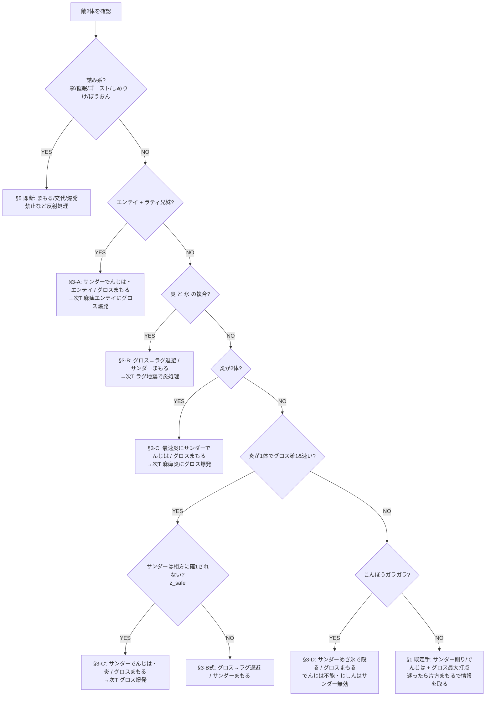

# 12. Phase 5 実機プレイブック（人間用・長考マップ＋1行条項集）

> ボット（2手読み探索＋sticky不変条件＋種別条項）の判断を、実機でヒトが使える決定木に翻訳したもの。
> 出典＝10-z-axis.md（条項・逸脱採掘・長考4分岐）／01-danger-pokemon.md（詰み系）／03-ai.md（AI挙動）／sim_v4marathon.py（条項実装）。
> **凍結v4構築**：先発 **サンダー@ラム**（10まん/めざ氷/でんじは/まもる）＋**メタグロス@せんせいのツメ**（コメパン/じしん/だいばくはつ/まもる）／後発 **ラティオス@ひかりのこな**＋**ラグラージ@たべのこし**。

## 0. 大原則（毎ターンこれに帰着させる）

1. **相手に乱数を振らせる回数を最小化する**。速く決着＝勝率が上がる。長引く対面ほど不利。
2. **だいばくはつが主砲**。危険分子（グロスを確定OHKOする敵）はほぼ全部グロス爆発でワンパン返しできる（**確定OHKO 19セット**＝炎16＋こんぼうガラガラ3。うち#454リザ・#455バクフはきあいのハチマキで1/8だけ1耐え＝厳密な必中撃破17/19。全リストは§8.1）。麻痺枠（サンダー）の仕事は「グロスが安全に爆発する1ターンを作る」こと。
3. **引き分け＝負け／相打ち全滅＝負け**（第3世代タワー仕様）。爆発・ほろびは必ず「生存者を残す座組み」で撃つ。

## 1. 開幕テンプレ（先発サンダー＋グロス）

- **既定手**：危険が無ければ、サンダーは10まん or でんじはで削り・速度管理、グロスはコメパン/じしんで最大打点。
- **迷ったらまもる**：初手で敵の最大打点が読めない時は、片方まもるでもう片方が殴ると情報が増える（次項の危険察知を回す）。
- **爆発を撃つターンは相方を必ずまもる**（sticky不変条件①。まもれない盤面なら爆発は中止）。

## 1.5 速度早見表（「上を取れているか」を即判断・全546セット基準）

| 自駒 | 素早さ | 抜かれる敵 | 意味（実戦の役割） |
|---|---:|---:|---|
| **ラティオス** | 350 | **6/546** | ほぼ全敵に先手＝着地後の最速掃除役。マルマイン自爆(316)級以外は上 |
| **サンダー** | 299 | 49/546 | 大半に先手＝でんじは/めざ氷を上から通せる。抜かれる49は氷/岩/自爆の高速勢 |
| **グロス** | 177 | 310/546 | **半分以上に抜かれる＝基本は"受け駒"**。まもる→爆発 or 麻痺で上を取る前提 |
| **ラグラージ** | 156 | 370/546 | 最遅。たべのこし＋耐久で「まもる／地震の的確な差し込み」で機能 |

- **含意**：先手で能動的に動けるのはサンダー・ラティ。グロス・ラグは「まもる／退避／麻痺後の爆発」で受けてから主導権を取る。**グロスに素の殴り合いをさせない**。

## 1.6 炎退避の相方分岐（グロス確1の炎16セット共通・要暗記）

- **退避先＝ラグラージ一択**。ラグ（水/地面）は炎半減で、**炎確1勢16セット全部を最大50%でしか受けない**（ファイヤーOH#791で50%が最大、他は36-46%）。グロスを引いてラグを出せば炎は無力化。
- **サンダーは残す**：炎はサンダーに等倍（OHKO不能）。サンダーはその場でめざ氷/10まんで炎を殴り返せる。
- 手順：**炎を見たら「グロス→ラグ退避 ＋ サンダーは残って殴る/まもる」**。炎1体なら§3-C'の麻痺爆発、炎×氷の複合なら§3-Bの退避を選ぶ。
- 例外：**こんぼうガラガラのじしん**は退避先ラグに等倍で入る（が飛行のサンダーには無効）。ガラガラは退避でなくサンダーめざ氷で処理（§3-D）。

## 1.7 開幕フローチャート（T1判断・上から順に照合）

## 2. 開幕・危険察知チェック（敵2体を見て5項目を即照合）

| 見るもの | 該当したら |
|---|---|
| **炎技持ち**（グロス確1の16セット＝ファイヤー/ヘルガー/ウインディ/バシャ/ブースター/リザ/バクフ/ブーバー） | §3-B/C の炎条項へ |
| **エンテイ ＋ ラティ兄妹** の同時先発 | §3-A（麻痺爆発ライン） |
| **一撃技/催眠/ゴースト/しめりけ/ぼうおん** | §5 の詰み系即断へ |
| **こんぼうガラガラ**（じしん・素早189） | §3-D（でんじは不能・§参照） |
| **先制アイテム（せんせいのツメ/きあいのハチマキ）持ちの高速アタッカー** | 乱数枠。まもる優先で被弾を1回減らす |

## 3. 種別条項（人間版・優先順位＝上から。1ターン1条項）

**A) エンテイ×ラティ**（麻痺爆発）
- T1：**サンダーでんじは（エンテイ）＋グロスまもる**。根拠＝ラティはグロスを確1不能（最大44%）なので、まもる裏でエンテイを麻痺させれば安全に土台が作れる。
- T2：**エンテイが麻痺したらグロスだいばくはつ（エンテイ）＋サンダーまもる**。麻痺で素早さ1/4→グロスが上から爆発。

**B) 炎×氷ピンサー**（炎→グロス確1 かつ 氷→サンダー確1、草いない）
- T1：**グロスをラグラージに退避＋サンダーまもる**。氷はサンダーを、炎はグロスを両取りしてくるので、両方まもる/退避でかわす。
- T2：**ラグラージのじしんで炎を処理**（ラグは炎に強く、地面が刺さる）。

**C) 炎×2（2体とも炎でグロス確1＆グロスより速い）**
- T1：**最速の炎にサンダーでんじは＋グロスまもる**。
- T2：**麻痺した炎にグロスだいばくはつ＋サンダーまもる**（爆発は両敵に当たる＝相方炎も巻き込む）。
- ※サンダーは炎等倍でOHKOされない。集中砲火でも生存する＝でんじはを安全に通せる。

**C') 麻痺爆発（炎1体＋別脅威）**
- **条件確認＝「サンダーが相方の敵に確1されないか」**（＝z_safe）。確1される相方なら別ライン（退避）へ。
- 安全なら T1：**サンダーでんじは（炎）＋グロスまもる** → T2：**グロス爆発（炎）＋サンダーまもる**。

**D) こんぼうガラガラ（でんじは不能・地面）**
- でんじは無効（地面）。**サンダーは飛行でじしん完全無効**なので、サンダーはめざ氷で殴り、グロスはまもる/退場で捌く。上取り不能でも詰まない（サンダーが安全に処理）。

**E) 爆発釣り**（敵の爆発圏で自分が2枚まもる価値がある局面）
- 敵が自爆で相打ちを狙える体力（HP50%以下）なら、こちらは無理に殴らずまもるで自爆を空振らせる。

## 4. 長考4分岐（静的ルール化不能＝ここがヒトの腕。候補手2〜3個を1ターン先まで脳内で回す）

1. **守るか殴るか**（逸脱の約45%）：「危険＝まもる」が過剰な局面がある。**敵の最大打点が実は半端（見かけ倒し）なら殴って主導権**を取る。速度早見表（10-z §実機用速度早見表）で「上を取れているか」を確認。
2. **爆発の押し引き**（最大の腕の見せ所・ボット非実装領域）：盤面が悪いほど**早めの爆発**が正着になりやすい。逆に殴って勝てる盤面での爆発は駒損。岩鋼の壁でグロスが手詰まりなら、爆発で大チップ＋相方削りに回す判断もある。
3. **同技のターゲット選択**：削り効率でなく「**次ターンの脅威を消す方**」を優先する場面。麻痺・爆発の"起点になる敵"を先に処理。
4. **でんじはの差しどころ**（ボット非実装領域）：守るターンの一部は麻痺撒きが上位互換。**高速の未麻痺脅威が2体並んだ時**が典型。ここはヒトだけが加点できる。

## 4.5 長考の境界【実験で確定・2026-07-22】—「いつまで考え、いつから反射でいいか」

**鉄則: 敵の残りが2体以上いる間は長考モード。敵がラス1体になったら §5/OtherWise の反射規則だけで打ってよい。**

根拠（同一シードのペア実験・探索= ボットの2手読み＝人間の長考に相当）:

| 政策 | 長考の範囲 | 負け率 |
|---|---|---|
| v4公式ボット | 全ターン探索 | 0.23%（1万戦） |
| 規則のみ(v1) | 長考ゼロ | 0.85%（1万戦） |
| 規則+まもる全廃(v2a) | 長考ゼロ | 1.14% ❌全廃は悪化 |
| 規則+合算確1優先(v2b) | 長考ゼロ | 0.99% ❌1行ルールでは埋まらない |
| 開幕T1-T2のみ長考(v2c) | 開幕だけ | 0.60%（2千戦・不足） |
| **敵2体の間は長考(v2d)** | **敵残1まで** | **0.10%＝公式と完全一致・不一致ペア0/2000** |

- **探索(長考)の価値は「敵が2体並んでいる局面」に事実上100%集中**。ラス1体になったら反射規則との差は2,000戦で1試合も出なかった。
- 開幕2ターンだけの長考では不足（0.60%）＝**2体目が出てきた後の対面も長考対象**。
- 規則の1行改造は2案とも悪化＝**反射規則(§1-§5+OtherWise)は既に局所最適**。いじらず、長考で上乗せする。
- 実機運用: タワーに持ち時間はない。**敵2体が見えている間は対面コンソール（playbook-console.html）で被ダメ・速度・条項を確認して1ターン先を読む**。敵が最後の1体になったら考えるのをやめてよい（時間節約＆ミス減）。
- **催眠（うたう含む36セット）**：ラム（サンダー）で1回は無効化。撒かれる前に速攻 or まもる。
- **ゴースト（17セット）**：**だいばくはつ無効**。爆発を撃たず、サンダー/ラティの技で処理。
- **ヌケニン#21（ふしぎなまもり・Bug/Ghost・ダブルでも出る）**：**v4の打点はラグラージ「いわなだれ」（岩2倍）だけ**。
  他は全て0ダメージ（コメパン鋼/じしん地/10まん電/めざ氷・れいB氷/サイキネ超＝すべて等倍以下でワンダーガード弾き、だいばくはつ＝ノーマルはゴースト無効）。
  → **鉄則: ラグラージを絶対に死なせない**（ラグが落ちるとヌケニンは我々には二度と倒せず、まもり続けても向こうのPP切れも起きない＝実質詰み）。
  HP1なので いわなだれ が当たれば一撃（命中90%×ラクスこう回避で実効≈85%、外したら次ターン再試行）。ダブルなので相方ごと削れる。
  **おんねん（Grudge）注意**：いわなだれで倒すと そのPPが全損し得る → 2体目ヌケニンが来ると打点消失（極稀）。旧C改の「カビゴンのシャドボ」処理はv4には存在しないので混同しない。
- **しめりけ（ゴルダック/ヌオー・特性率ちょうど50%で判別不能）**：**見えたら爆発禁止**（不発で自分だけ倒れる最悪手）。
- **ぼうおん（12セット）**：ほろび・鳴き系無効。該当編成では歌に頼らない。
- **まもる持ち（18セットのみ）**：AIの連続まもるは−2でほぼ来ない → 「1回まもらせてから爆発」が正着。

## 6. 保険則（シム楽観・未実装分を実機で厚く見る）

- **しろいハーブ疑いの炎は「2発目もフルパワー」で想定**（オーバーヒートの特攻ダウンをハーブが即復帰。ヘルガー/ウインディ/ギャロップ/ファイヤー等17セット）。2発目で耐える計算をアテにしない＝早めに退避/爆発で決着。
- **先制アイテム（せんせいのツメ20%/きあいのハチマキ）**：確定処理のつもりでも1回は貫通される前提で、生存者を残す。
- **回避（ひかりのこな/かげぶんしん）**：命中抽選が増える＝乱数枠。長引かせず速攻。

## 7. 練習運用（Phase 5・07-hardware-proof.md連動）

- 本番＝実機（GC＋GBプレーヤー録画）。練習＝エミュ（mGBA/Delta）でこの決定木の分岐を反復。
- 反復すべき最重要分岐：**炎退避の相方分岐**（§3-B/C）・**麻痺爆発の起爆手順**（§3-A/C'）・**爆発の押し引き**（§4-2）。
- 期待総戦数≈5,050戦（1000連勝の期待所要）。負けた棋譜も保存＝Phase 5の敗因一次データ。
---

## 8. 条項別・発動敵セット完全リスト（実データ546セット・敵IV31・最悪特性分岐）

> 検算＝実`damage_range`（`enum_clauses.py`/`verify19.py`, 型バグassert通過）で独立再列挙。
> **「確定OHKO(確1)」＝最小ロールでも相手を倒す＝乱数無関係で1発**。**「OHKO圏」＝最大ロールで届く＝乱数次第**。
> sim条項はhi(最大ロール)基準で発動するため起動集合はやや広いが、**実戦の暗記は確定(lo)基準**で行う。

### 8.1 グロスだいばくはつが確定OHKOする「危険分子」＝**19セット**（爆発が主砲である根拠）

炎確1×16 ＋ こんぼうガラガラ(じしん)×3。爆発返しは全19が確定OHKO圏で「全部ワンパン」が成立（爆発ダメ min=532/ガラガラ ～ max=1178/ヘルガー）。
★＝きあいのハチマキ(Focus Band)保持で1/8だけ1耐え＝厳密な必中撃破は17/19、残2(#454/#455)は7/8撃破。

| id | 種族 | 被(最大打点) | 爆発返し | 敵HP | 判定 |
|---|---|---|---:|---:|---|
| #454 | リザードン | だいもんじ397-468 | 709-835 | 297 | 確1(★FB) |
| #455 | バクフーン | だいもんじ397-468 | 709-835 | 297 | 確1(★FB) |
| #470 | ガラガラ | じしん399-470 | 532-627 | 261 | 確1 |
| #511 | ブーバー | だいもんじ374-440 | 907-1068 | 271 | 確1 |
| #522 | ヘルガー | だいもんじ399-470 | 1001-1178 | 291 | 確1 |
| #579 | ガラガラ | じしん399-470 | 532-627 | 261 | 確1 |
| #656 | ウインディ | オーバーヒート435-512 | 695-818 | 321 | 確1 |
| #675 | ガラガラ | じしん399-470 | 532-627 | 261 | 確1 |
| #714 | ヘルガー | オーバーヒート465-548 | 1001-1178 | 291 | 確1 |
| #732 | ブースター | オーバーヒート423-498 | 872-1027 | 271 | 確1(低速spe149) |
| #739 | バシャーモ | オーバーヒート425-500 | 774-911 | 301 | 確1 |
| #742 | リザードン | オーバーヒート394-464 | 709-835 | 297 | 確1 |
| #743 | バクフーン | オーバーヒート394-464 | 709-835 | 297 | 確1 |
| #752 | ウインディ | オーバーヒート397-468 | 695-818 | 321 | 確1 |
| #769 | ファイヤー | オーバーヒート464-546 | 630-742 | 321 | 確1 |
| #780 | ファイヤー | だいもんじ438-516 | 630-742 | 321 | 確1 |
| #791 | ファイヤー | オーバーヒート510-600 | 630-742 | 321 | 確1 |
| #874 | ファイヤー | オーバーヒート464-546 | 630-742 | 321 | 確1 |
| #875 | ファイヤー | オーバーヒート464-546 | 630-742 | 321 | 確1 |

（参考）確定ではないが1発圏＝**乱数OHKO 9セット（全て炎）**：#560ウインディ/#611ギャロップ/#618ヘルガー/#643バシャーモ/#646リザードン/#707ギャロップ/#718キュウコン/#758ファイヤー/#771エンテイ。これらはv2の「確1」から正しく除外されている。

### 8.2 グロス確定OHKOの炎＝**16セット/8種**（§1.6 退避判断・各セットの対ラグラージ炎打点）

種族＝ファイヤー5/リザードン2/バクフーン2/ヘルガー2/ウインディ2/バシャーモ1/ブーバー1/ブースター1。退避先ラグ（水/地面）は炎半減で、**炎技だけなら全16を最大50%（#791ファイヤーOH）でしか受けない**。

| id | 種族 | 技 | ダメ | 対ラグ% |
|---|---|---|---:|---:|
| #454 | リザードン | だいもんじ | 114-135 | 33-39 |
| #455 | バクフーン | だいもんじ | 114-135 | 33-39 |
| #511 | ブーバー | だいもんじ | 107-126 | 31-36 |
| #522 | ヘルガー | だいもんじ | 114-135 | 33-39 |
| #656 | ウインディ | オーバーヒート | 124-147 | 36-43 |
| #714 | ヘルガー | オーバーヒート | 133-157 | 39-46 |
| #732 | ブースター | オーバーヒート | 121-143 | 35-41 |
| #739 | バシャーモ | オーバーヒート | 122-144 | 35-42 |
| #742 | リザードン | オーバーヒート | 113-133 | 33-39 |
| #743 | バクフーン | オーバーヒート | 113-133 | 33-39 |
| #752 | ウインディ | オーバーヒート | 114-135 | 33-39 |
| #769 | ファイヤー | オーバーヒート | 133-157 | 39-46 |
| #780 | ファイヤー | だいもんじ | 124-147 | 36-43 |
| #791 | ファイヤー | オーバーヒート | 146-172 | 42-50 |
| #874 | ファイヤー | オーバーヒート | 133-157 | 39-46 |
| #875 | ファイヤー | オーバーヒート | 133-157 | 39-46 |

**⚠️退避の例外（要暗記・実測）**：**ソーラービーム＋にほんばれ持ちの炎3セット**は晴れ下フルパワーのSBがラグに4倍で刺さり確1＝**#714ヘルガー212%／#771エンテイ185%／#611ギャロップ158%**。ただし にほんばれ1手（無晴れ時はSB溜めも）を要するので即死でなく「1テンポ置いて」の脅威。この3セットが見えたら退避に頼らず速攻で処理する。

### 8.3 サンダー確定/乱数OHKOの氷＝**19セット**（§3-B 炎×氷ピンサーの氷側）

★＝確定OHKO(7セット)。%はhi/322。

| 種族 | セット（%=hi/322） |
|---|---|
| フリーザー(5) | #789★126 #870★126 #756 110 #778 100 #871 100 |
| レジアイス(4) | #774★144 #763 114 #785 114 #839 114 |
| ルージュラ(2) | #377★125 #665★125 |
| ラプラス(2) | #821★129 #744 102 |
| トドゼルガ(2) | #740 110 #452 108 |
| ジュゴン(2) | #488 104 #392 100 |
| オニゴーリ(2) | #495★164(だいばくはつ) #591 104 |

※#495オニゴーリの確定OHKOは氷技でなく**だいばくはつ**（氷技Icy Windは39%）。炎×氷ピンサー(§3-B)は「炎確1 と 氷確1 が同時先発かつ草不在」で成立。

### 8.4 麻痺爆発ラインの炎（§3-C/C'）＝**速い炎確定OHKO 15セット**（spe順）

いずれもグロス(spe177)より速い＝でんじは→次T麻痺爆発の対象。

| id | 種族 | spe31 | 対グロス | 技 |
|---|---|---:|---|---|
| #454 | リザードン | 299 | 109-128% | だいもんじ |
| #455 | バクフーン | 299 | 109-128% | だいもんじ |
| #522 | ヘルガー | 289 | 109-129% | だいもんじ |
| #656 | ウインディ | 289 | 119-140% | オーバーヒート |
| #714 | ヘルガー | 289 | 127-150% | オーバーヒート |
| #752 | ウインディ | 289 | 109-128% | オーバーヒート |
| #511 | ブーバー | 285 | 102-120% | だいもんじ |
| #780 | ファイヤー | 279 | 120-141% | だいもんじ |
| #874 | ファイヤー | 279 | 127-150% | オーバーヒート |
| #742 | リザードン | 278 | 108-127% | オーバーヒート |
| #743 | バクフーン | 278 | 108-127% | オーバーヒート |
| #769 | ファイヤー | 216 | 127-150% | オーバーヒート |
| #875 | ファイヤー | 216 | 127-150% | オーバーヒート |
| #739 | バシャーモ | 196 | 116-137% | オーバーヒート |
| #791 | ファイヤー | 194 | 140-164% | オーバーヒート |

- **低速・別扱い**：#732ブースター(spe149)は確定OHKO(116-136%)だがグロスより遅く、sim FIRE集合外＝麻痺爆発ラインに乗せず人力別処理でよい（8.2の16＝この15速＋#732）。
- **sim条項はhi基準で+9セット追加発動**（乱数OHKO・全て速い炎）：#646/#718/#771/#560/#618/#611/#707/#643/#758。列挙目的が「確定」なら15(+#732)、「sim起動集合」なら24と使い分ける。

### 8.5 エンテイ×ラティ（§3-A 麻痺爆発ライン）

発動＝lead2が {エンテイ1体} かつ {ラティオス or ラティアス 1体}。根拠＝ラティは対グロス最大42%(#777/#788じしん)で確1不能→まもる裏でエンテイをでんじは→麻痺エンテイの上からグロス爆発。

| 種族 | set_id（全） |
|---|---|
| エンテイ(6) | #760 #771 #782 #793 #878 #879 |
| ラティオス(8) | #766 #777 #788 #799 #846 #847 #848 #849 |
| ラティアス(8) | #765 #776 #787 #798 #842 #843 #844 #845 |

- エンテイの対グロス打点：#771=112%(乱1・だいもんじ)/#760・#793=89%/他≤79%。ラティ兄妹の対グロス最大=42%(＜確1)。
- 両系統を保有しうるトレーナー7人：**T223 T227 T230 T233 T250 T253 T263**（T263のみラティオス・ラティアス両系統を保有）。

### 8.6 こんぼうガラガラ（§3-D）全4セット

| id | spe31 | じしん | 対ラグ最大 | 対サンダー最大 | 区分 |
|---|---:|---|---|---|---|
| #470 | 189(速) | 有 | 97%(じしん) | 108%(いわなだれ) | 危険(EQ+つるぎのまい) |
| #579 | 189(速) | 有 | 97%(じしん) | 108%(いわなだれ) | 危険(EQ+つるぎのまい) |
| #675 | 189(速) | 有 | 97%(じしん) | 108%(いわなだれ) | 危険(EQ+つるぎのまい) |
| #387 | 126(遅) | **無** | 48%(ボーンラッシュ) | 108%(いわなだれ) | 低速・EQ無 |

- じしん有3セットは退避先ラグをほぼ確1（グロスより速い）。#387は低速・じしん無で退避は安全。
- **⚠️§3-Dの楽観に注意（実測）**：サンダーめざ氷はガラガラを**確1できない**（#387=71%/#470・579・675=88%）→処理に2ターン要。返しの**いわなだれは対サンダー乱1(92-108%,最大350/322)**で、2ターン被弾中に乱数落ちの筋がある。サンダーは全ガラガラより速いが「安全に処理」ではなく「速いが1発では倒せない」が正確。

### 8.7 詰み系6カテゴリ（§5・01-danger準拠）— 実プール検算 **全一致**

| カテゴリ | 記載 | 実データ | set_id |
|---|---:|---:|---|
| 一撃技 | 23 | 23 ✓ | 333 354 358 369 414 499 564 576 584 595 606 619 621 644 660 672 680 691 715 717 740 822 823 |
| 催眠(あくび含) | 36 | 36 ✓ | 267 282 312 313 334 377 395 401 421 437 441 452 456 462 467 471 475 480 491 497 505 506 534 541 558 563 569 574 604 611 633 665 670 755 805 823 |
| ゴースト型(爆発無効) | 17 | 17 ✓ | 21 374 378 421 472 476 517 566 570 613 662 666 709 800 801 802 803 |
| しめりけ | 8 | 8 ✓ | 388 418 471 514 580 610 676 706（ヌオー4/ゴルダック4） |
| ぼうおん | 12 | 12 ✓ | 380 396 397 478 492 493 572 588 589 668 684 685（バリヤード4/マルマイン4/バクオング4） |
| まもる・みきり | 18 | 18 ✓ | 371 396 399 417 419 443 452 453 475 476 477 481 561 610 679 769 772 778 |

---

## 9. 頻出リード即断表（上位20・10万戦集計）

> `enemy_team(random.Random(seed))` = `play_battle`の`b.foe[:2]` 一致を検証の上、seed=25000000+i の10万戦で開幕2体（ダブル＝両active・順不同）の種族ペアを集計。
> リードは高分散：最頻でもカイリュー+バンギラス0.406%、**上位20累計でも全リードの約3.62%**。特定リード対策より汎用手（§1）の徹底が効く裏付け。

| 順位 | リード（頻度） | 条項 | T1推奨初手（サンダー / グロス） | 危険注記 |
|---|---|---|---|---|
| 1 | カイリュー+バンギラス（0.406%） | §1（要長考） | でんじは（速い方=DD警戒）／コメパン。爆発は主砲として温存 | バンギラス サンダー確1(2/10・岩雪崩)だが低速→サンダー先手(299)。竜舞前に処理 |
| 2 | カイリキー+チャーレム（0.202%） | §1 | 10まん（格闘等倍）／コメパン or じしん | 脅威フラグなし。ダイパン混乱注意→迷えばグロスまもる |
| 3 | サーナイト+スターミー（0.187%） | §1（催眠注記） | 10まん（スターミー）／コメパン | さいみん(命中60)＝ラムで1回無効。スターミーICEだがサンダー非確1 |
| 4 | カイリキー+メタグロス（0.186%） | §1→§3-E | でんじは or 10まん／グロスまもる寄り | 敵メタグロス自爆2＋サンダー確1(2/8低速)。自爆はHP50%以下解禁(T1満タン安全)→削れたら§3-E |
| 5 | ハリテヤマ+カイリキー（0.179%） | §1 | 10まん／コメパン | 脅威フラグなし（格闘2枚） |
| 6 | ラティオス+バンギラス（0.176%） | §1 | でんじは（ラティ同速350対策）／コメパン | バンギラス低速サンダー確1。ラティは光の粉・タゲ選択注意 |
| 7 | ゲンガー+ヘルガー（0.176%） | §3-C'（麻痺爆発） | T1 サンダーでんじは（ヘルガー）＋グロスまもる → T2 グロスだいばくはつ（ヘルガー）＋サンダーまもる | ★唯一のグロス確1リード。ヘルガー(3/4setがOHKO圏・速)＝麻痺で無力化。ゲンガーはゴースト＝爆発無効だがヘルガーには命中。ゲンガー催眠はラム受け。白ハーブ2発想定(§6) |
| 8 | スターミー+ナマズン（0.174%） | §5（一撃） | グロスまもる／サンダー10まんで削り | ナマズン一撃技2(#672 QCじわれ)＝まもるで透かす |
| 9 | スターミー+ホエルオー（0.173%） | §5（一撃） | グロスまもる／サンダー10まんで削り | ホエルオー一撃技2(#717 QCじわれ) |
| 10 | ラプラス+カイリキー（0.167%） | §5（一撃＋催眠） | グロスまもる／サンダーめざ氷 or まもる | ラプラス#823 QCぜったいれいど＋うたう。ラムでうたう1回無効。ICEでサンダー確1(2/8低速) |
| 11 | ヘラクロス+カイリキー（0.166%） | §1 | 10まん／コメパン | 脅威フラグなし（サンダーに飛行技無=めざ氷/10まん等倍） |
| 12 | キノガッサ+カイリキー（0.165%） | §5（催眠・必中） | サンダーめざ氷(草4倍→2倍) or 10まん／グロスまもる | ★キノガッサ ほうし必中3set(#480/#574/#670)。ラム1回のみ無効＝撒かれる前に速攻 |
| 13 | メタグロス+スターミー（0.163%） | §1→§3-E | でんじは or コメパン／グロスまもる寄り | 敵メタグロス自爆2＋サンダー確1(低速)。#4と同型。削れたら§3-E |
| 14 | ラティアス+バンギラス（0.163%） | §1 | でんじは／コメパン | バンギラス低速サンダー確1。ラティアス光の粉注意 |
| 15 | カイリュー+ゲンガー（0.162%） | §1（ゴースト＝爆発不可注記） | サンダーめざ氷（カイリュー4倍）／グロスはコメパンで殴る | ゲンガー ゴースト(爆発無効)＋催眠。爆発の的はカイリュー側に限定 |
| 16 | ゲンガー+ムウマ（0.157%） | §5（2体ゴースト） | 爆発完全放棄。サンダー10まん/めざ氷＋ラティ/グロス通常打点で特殊処理 | 両ゴースト＝爆発無効。ムウマ#566 ほろび/くろまな警戒（残2匹時は即処理） |
| 17 | ランターン+スターミー（0.156%） | §1 | 10まん／コメパン | 脅威フラグなし。長期戦（耐久水電）注意、速攻で終わらせる |
| 18 | カイリュー+ラティアス（0.156%） | §1 | サンダーめざ氷（カイリュー4倍）／コメパン | 竜2枚。DD積む前に。ラティアス光の粉 |
| 19 | メタグロス+バンギラス（0.155%） | §1→§3-E | グロスまもる寄り／でんじは | 敵メタグロス自爆2＋両者サンダー確1(低速)。T1安全→削れたら§3-E |
| 20 | ボーマンダ+バンギラス（0.154%） | §1 | サンダーめざ氷（竜飛=氷2倍）or でんじは／コメパン | ボーマンダ威嚇でグロス攻撃-1注意。バンギラス低速サンダー確1 |

### 条項分布（上位20）
| 条項 | 組数 | 該当リード |
|---|---:|---|
| §1 既定手 | 12 | #1,2,3,5,6,11,14,15,17,18,20 |
| §5 詰み系 | 5 | #8,9（一撃QCじわれ）/#10（一撃QCれいど＋うたう）/#12（必中ほうし）/#16（2体ゴースト） |
| §3-C' 麻痺爆発 | 1 | #7 ゲンガー+ヘルガー（唯一のグロス確1リード） |
| §3-E 爆発釣り（実質§1） | 3 | #4,13,19（敵メタグロス自爆・HP50%以下で解禁） |
| §3-A / §3-B / §3-D | 0 | 上位20に非出現＝エンテイ×ラティ・炎×氷ピンサー・こんぼうガラガラは低頻度特殊対面 |

### 参考：単騎リード頻度（foe[0] or foe[1]・出現率）
スターミー2.37%／カイリキー2.21%／バンギラス2.15%／メタグロス2.09%／カイリュー2.02%／ラプラス1.82%／サーナイト1.51%／ゲンガー1.51%／ボーマンダ1.40%／ヤドラン1.22%／バシャーモ1.21%／リザードン1.21%／ギャラドス1.17%／ルージュラ1.15%／ヤドキング1.13%。
※炎(バシャ/リザ)・氷(ラプラス/ルージュラ)は単騎では頻出だが、相方に炎/氷が同時に来る「ピンサー」ペアは上位20圏外の低頻度。

---
*プレイブックv3（2026-07-21）: §1-7=実戦決定木、§8=条項別発動敵セット完全リスト（実エンジン検証済）、§9=頻出リード即断表（10万戦集計・上位20）。数値は全て実で独立再検算（型バグassert通過）。残る穴＝実機リハでしか埋まらない長考2点（爆発の押し引き・でんじはの差しどころ）。リハ100-200戦で詰まった分岐を追記しv4へ。*
