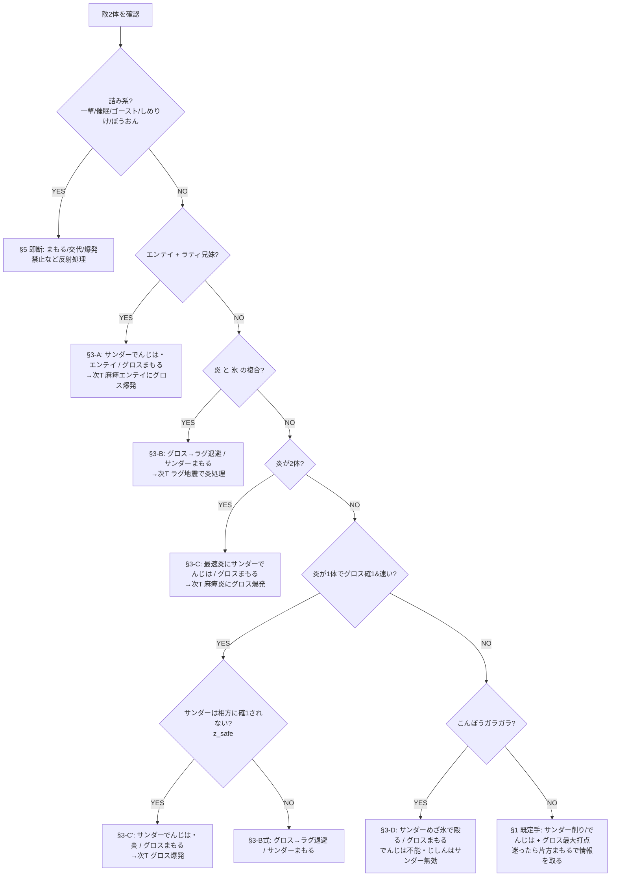

# 12. Phase 5 実機プレイブック（人間用・長考マップ＋1行条項集）

> ボット（2手読み探索＋sticky不変条件＋種別条項）の判断を、実機でヒトが使える決定木に翻訳したもの。
> 出典＝10-z-axis.md（条項・逸脱採掘・長考4分岐）／01-danger-pokemon.md（詰み系）／03-ai.md（AI挙動）／sim_v4marathon.py（条項実装）。
> **凍結v4.1構築（2026-08-10再走から）**：先発 **サンダー@ラム**（10まん/めざ氷/でんじは/まもる）＋**メタグロス@せんせいのツメ**（コメパン/じしん/だいばくはつ/まもる・**EV H252/A228/B0/D24/S4＝実数値399/296/222**）／後発 **ラティオス@ひかりのこな**＋**ラグラージ@たべのこし**（めざ岩70）。

## 0. 大原則（毎ターンこれに帰着させる）

1. **相手に乱数を振らせる回数を最小化する**。速く決着＝勝率が上がる。長引く対面ほど不利。
2. **だいばくはつが主砲**。危険分子（グロスを確定OHKOする敵）はほぼ全部グロス爆発でワンパン返しできる（**確定OHKO 19セット**＝炎16＋こんぼうガラガラ3。うち#454リザ・#455バクフはきあいのハチマキで1/8だけ1耐え＝厳密な必中撃破17/19。全リストは§8.1）。麻痺枠（サンダー）の仕事は「グロスが安全に爆発する1ターンを作る」こと。
3. **引き分け＝負け／相打ち全滅＝負け**（第3世代タワー仕様）。爆発・ほろびは必ず「生存者を残す座組み」で撃つ。

## 1. 開幕テンプレ（先発サンダー＋グロス）

- **既定手**：危険が無ければ、サンダーは10まん or でんじはで削り・速度管理、グロスはコメパン/じしんで最大打点。
- **迷ったらまもる**：初手で敵の最大打点が読めない時は、片方まもるでもう片方が殴ると情報が増える（次項の危険察知を回す）。
- **爆発を撃つターンは相方を必ずまもる**（sticky不変条件①。まもれない盤面なら爆発は中止）。

### なぜラグ先発にしないのか（2026-08-09・実機581停止の敗因分析で数値化）

先発は**種族名しか見えていない状態**で最初の一撃を受ける枠。だから「即死ラインの数」と
**「即死ラインが種族名から読めるか」**の2軸で決まる。全546セット実測：

| 自駒 | 被確1（最小で即死） | 被OHKO圏 | 被確2 | 即死ラインの内訳と可視性 |
|---|---|---|---|---|
| **グロス** | **19** | 29 | 140 | オバヒ11＋だいもんじ5＋ガラガラ地震3 ＝ **全て種族名を見た瞬間に分かる**（炎タイプ＋ガラガラ）→ §1.6退避で消せる |
| **ラグ** | **38（2倍）** | 47 | 94 | **爆発18＋草打点20**（ソラビ15/リフブレ4/ギガドレ1）＝ 爆発持ち14種族は**全て持ち/非持ちセットが混在**（種族から確定できる爆発持ちは0種族）。草打点も21種族で混在。**→ 見てから避けられない** |
| サンダー | 32 | 57 | 225 | 氷・岩など。速度と打点でリスクに見合う |
| ラティ | 35 | 51 | 213 | 控えの保険役（こな回避・ふゆう） |

- ラグは被確2は94と**継戦耐久ならグロスより上**（H404）。※表は2026-08-09採用のA228/B0/D24基準（被確1は旧EVと同数・OHKO圏+1は#647）。柔らかいのではなく、**尾リスクの質が悪い**：
  即死ラインが2倍あり、しかもその大半（爆発・ソラビ）は**セット依存で開幕には不可視**。
  グロスの19本は全部「見える」ので退避ドクトリンで構造的に消せる——ここが先発適性の本質的な差。
- 敵の爆発24セットに対しても、グロスは**全て確定耐え**（§4.3）、ラグは**18セットに確定で落とされる**。
- 結論：**先発サンダー＋グロスを維持**。ラグは「地震のタイプ一致砲＋ヌケニン保険」として後ろから出すのが最適配置。

## 1.4 先発ペア別の即死リスク【2026-08-17・30万戦MCで定量化】

> ユーザー質問「ラグ＋サンダー先発だと爆発はどれくらい飛ぶ？OHKOの危険対象は？」への回答。
> 敵チームは `trainers.csv`（ID200-299）から種族/持ち物重複を排して4体抽出、先発＝先頭2体。30万戦モンテカルロ。

| 先発 | **両取り爆発**（1発で先発2体とも確定OHKO） | どちらかが確1される | 両方が確1圏 |
|---|---:|---:|---:|
| **サンダー＋メタグロス（標準）** | **0.00%** | 20.51% | **0.47%** |
| **ラグラージ＋サンダー** | **7.87%** | 19.14% | **8.01%** |
| サンダー＋ラティオス | 8.97% | 16.14% | 10.13% |
| メタグロス＋ラグラージ | 0.00% | 21.32% | 1.48% |

**メタグロスが場にいる先発は「両取り爆発 0.00%」。** これが §1 の「先発サンダー＋グロス固定」の数値的な根拠。

### 爆発：ラグ＋サンダー先発の場合

- 先発2体のどちらかが**爆発持ちである確率＝9.17%**（チーム4体のどこかにいるのは16.74%）
- **爆発24セット中19セットが、サンダーとラグラージを1発で同時に確定OHKOする**
  → **両取り爆発が先発に来るのは 7.87%（約13戦に1回）**
- 対してメタグロスは**24セット全てを確定耐え**（最大272/364＝75%）

| | サンダー(322) | ラグラージ(404) | メタグロス(364) |
|---|---:|---:|---:|
| 爆発24セット中 確定OHKOされる | **23** | **19** | **0** |

**⚠️ しかも満タン抑制がほぼ効かない。** §2.2の −3 は「敵が先手側」のときだけ乗るが、
**サンダー(S299)より速い爆発持ちは 2/24 しかいない**（マルマイン#588/#684 のS316のみ）。
残る22セットはこちらが先手側＝**満タンから普通に爆発してくる**。
（ラグ(S156)より速いのは 8/24。ラグ単独ならもう少し抑制が効くが、サンダーが並ぶと最良スコアが上がる＝§3.5③）

**爆発でサンダー／ラグを両取りする19セット**
```
#495 オニゴーリ  #832/#835 メタグロス  #590/#686 ダーテング  #716 ネンドール
#597/#693 マタドガス  #726 ナッシー  #762/#773/#837 レジロック  #594/#690 ゴローニャ
#708 ベトベトン  #671/#575 フォレトス  #625/#721 ハガネール
```
※両取りにならない5セット＝マルマイン#588/#684（ラグは乱1）・ナッシー#630（ラグは乱1）・
レジスチル#786（ラグは耐え）・レジアイス#785（両方耐え）

### OHKOの危険対象（一撃必殺技ではなく「通常技での確定OHKO」）

| 自駒 | 確定OHKOしてくる敵セット | 先発に出る確率 |
|---|---:|---:|
| **ラグラージ** | **38** | **14.23%** |
| **サンダー** | **32** | **12.52%** |
| （参考）メタグロス | 19 | 8.35% |

**サンダーを確1する先発 トップ8**

| set | 種族 | 頻度 | S | 持ち物 |
|---|---|---:|---:|---|
| #665 | ルージュラ | 0.93% | 226 | ラムのみ |
| #721 | ハガネール | 0.67% | 96 | **QC** |
| #705 | アーマルド | 0.66% | 126 | こだわりハチマキ |
| #664 | グランブル | 0.65% | 113 | こだわりハチマキ |
| #671 | フォレトス | 0.59% | 116 | **QC** |
| #726 | ナッシー | 0.57% | 146 | ひかりのこな |
| #686 | ダーテング | 0.54% | 196 | きあいのハチマキ |
| #716 | ネンドール | 0.53% | 186 | きあいのハチマキ |

**ラグラージを確1する先発 トップ8**

| set | 種族 | 頻度 | S | 持ち物 |
|---|---|---:|---:|---|
| **#714** | **ヘルガー** | **0.77%** | **289** | しろいハーブ（→§1.6のソーラービーム穴） |
| #682 | ラフレシア | 0.75% | 122 | **QC** |
| #729 | フシギバナ | 0.72% | 196 | ラムのみ |
| #721 | ハガネール | 0.67% | 96 | **QC** |
| #671 | フォレトス | 0.59% | 116 | **QC** |
| #726 | ナッシー | 0.57% | 146 | ひかりのこな |
| #686 | ダーテング | 0.54% | 196 | きあいのハチマキ |
| #716 | ネンドール | 0.53% | 186 | きあいのハチマキ |

**一撃必殺技持ちが先発に出る確率＝8.62%**（チーム4体のどこかなら15.77%）。これは先発ペアに依存しない。

### 結論

**ラグ＋サンダー先発は「約13戦に1回、爆発1発で盤面が消える」構成。**
標準のサンダー＋グロスならこの筋が **0.00%** になる。
2026-08-09の581連勝停止（ラグ先発の試行中に敗北）は、この数字と整合する。

## 1.5 速度早見表（「上を取れているか」を即判断・全546セット基準）

| 自駒 | 素早さ | 抜かれる敵 | 意味（実戦の役割） |
|---|---:|---:|---|
| **ラティオス** | 350 | **6/546** | ほぼ全敵に先手＝着地後の最速掃除役。マルマイン自爆(316)級以外は上 |
| **サンダー** | 299 | 49/546 | 大半に先手＝でんじは/めざ氷を上から通せる。抜かれる49は氷/岩/自爆の高速勢 |
| **グロス** | 177 | 310/546 | **半分以上に抜かれる＝基本は"受け駒"**。まもる→爆発 or 麻痺で上を取る前提 |
| **ラグラージ** | 156 | 370/546 | 最遅。たべのこし＋耐久で「まもる／地震の的確な差し込み」で機能 |

- **含意**：先手で能動的に動けるのはサンダー・ラティ。グロス・ラグは「まもる／退避／麻痺後の爆発」で受けてから主導権を取る。**グロスに素の殴り合いをさせない**。

## 1.6 炎退避の相方分岐（グロス確1の炎16セット共通・要暗記）

- **退避先＝ラグラージ。ただし例外1つ**（2026-07-30に現行スペックで全16セット再計算）。ラグ（水/地面）は炎半減で、**16セット中15は最大42%**（#522ヘルガーのかみくだく。純粋な炎技なら最大40%＝#791ファイヤーOH）。グロスを引いてラグを出せば炎は無力化。
- **⚠️ 唯一の罠＝ヘルガー#714（しろいハーブ・オーバーヒート/ソーラービーム/かみくだく）**：**ソーラービームがラグに草4倍で170%＝確定OHKO**。ここへ退避するとラグが飛ぶ（＝ヌケニン保険も同時に失う二重事故）。
  - 見分け方：ヘルガーは2セットのみ。**#522（ラムのみ・だいもんじ/かみくだく/ほえる）は退避OK、#714（しろいハーブ）は退避NG**。持ち物が見えない初手では**ヘルガー相手のラグ退避は避ける**（サンダー側で処理するか、グロスはまもるで1ターン様子見）。
  - 救い：ソーラービームは晴れていなければ**溜め1ターン**が必要＝溜めを見てから逃がせる。溜めが見えたらラグを即座に下げる。
- ※旧版は「全16セットを最大50%」と記載していたが、これは(a)ソーラービームを勘定していない (b)確定前のEV配分での計算、の2点で誤り。上記が現行v4スペック（HP404/防215/特防207）での実測値。
- **サンダーは残す**：炎はサンダーに等倍（OHKO不能）。サンダーはその場でめざ氷/10まんで炎を殴り返せる。
- 手順：**炎を見たら「グロス→ラグ退避 ＋ サンダーは残って殴る/まもる」**。炎1体なら§3-C'の麻痺爆発、炎×氷の複合なら§3-Bの退避を選ぶ。
- 例外：**こんぼうガラガラのじしん**は退避先ラグに等倍で入る（が飛行のサンダーには無効）。ガラガラは退避でなくサンダーめざ氷で処理（§3-D）。

## 1.6b 退避先の選択：ラグ引き／ラティ引き／居座り（まもる＋でんじは）
【2026-07-30・実戦運用（相方次第で選び分け）を数値で裏付け・`verify_docs.py 1.6b` で再現可】

§1.6の「ラグ一択」は**炎だけを見た場合の話**。実戦では**相方の敵**が選択を決める。全16セットの実測：

| id | 種族 | spe | → ラティオス(HP302) | → ラグラージ(HP404) |
|---|---|---:|---|---|
| **#714** | **ヘルガー**（しろいハーブ） | 289 | 92% かみくだく | **170% ソーラービーム＝確1** |
| #522 | ヘルガー（ラムのみ） | 289 | 92% かみくだく | 42% かみくだく |
| #732 | ブースター | 149 | 82% シャドーボール | 42% すてみタックル |
| #656 / #752 | ウインディ | 289 | 58% / 52% かみくだく | 34% / 31% オーバーヒート |
| #791 / #875 | ファイヤー | 194 / 216 | 51% すてみタックル | 40% / 37% オーバーヒート |
| 残り9セット | リザ・バクフ・ブーバー・バシャ・ファイヤー3 | — | 32〜40% | 29〜37% |

**読み取れる原則**

1. **炎そのものはラティオスを一体も確1できない**（最大92%＝#714/#522ヘルガーのかみくだく）。
   つまり**ラティ引きは炎に対しては常に「耐える」**。ただし被弾は大きく、次の行動で押し切られやすい。
2. **純粋な受けの強さはラグが上**（29〜42% vs 32〜92%）。**既定はラグ引きで正しい**。
3. **#714ヘルガーだけがラグ引きを禁じる**（ソーラービーム170%）。ここは**ラティ引き（92%で耐える）か居座り**。

**相方（もう1体の敵）による選択表**

| 相方の脅威 | 選択 | 理由 |
|---|---|---|
| 特になし／物理アタッカー | **ラグ引き** | 炎を29〜42%で流す最硬の受け |
| **草技持ち**（ソーラービーム等） | **ラティ引き** | ラグは草4倍。ラティは草を等倍で受け、しかも上から動ける |
| **氷・悪・ゴースト・虫・竜**を持つ | **ラグ引き** | ラティはこれらが2倍。プール全体で**51セットがラティをOHKO圏**に入れる（ラグは47セット） |
| **両方該当**（例：ヘルガー#714＋氷持ち） | **まもる＋でんじは** | 退避先が両方危険なら交代せず、麻痺で速度を奪って次ターンの選択肢を作る |
| ヘルガーで持ち物が見えない | **ラティ引き or 居座り** | #714か#522か判別できない＝ラグ引きは170%の賭けになる |

**居座り（まもる＋でんじは）が正解になる条件**：①退避先が両方危険 ②または退避しても次ターンの解決手が無い。
麻痺は**炎の素早さ289→72**まで落とすので、グロス(177)が上から動けるようになり、翌ターンの爆発ラインが復活する。

> **記録メモ**：この選択の使い分けは、まず実機プレイ（2026-07-30時点で442連勝の実戦）で運用されていたものを、
> 後からエンジンで全数検証して裏付けた。ボットの条項（§3-B/C）は「ラグ退避」に固定されており、
> **この分岐は現時点で人間側が上回っている領域**（§4の長考4分岐と同じ性質）。

## 1.7 開幕フローチャート（T1判断・上から順に照合）



## 2. 開幕・危険察知チェック（敵2体を見て5項目を即照合）

| 見るもの | 該当したら |
|---|---|
| **炎技持ち**（グロス確1の16セット＝ファイヤー/ヘルガー/ウインディ/バシャ/ブースター/リザ/バクフ/ブーバー） | §3-B/C の炎条項へ |
| **エンテイ ＋ ラティ兄妹** の同時先発 | §3-A（麻痺爆発ライン） |
| **一撃技/催眠/ゴースト/しめりけ/ぼうおん** | §5 の詰み系即断へ |
| **こんぼうガラガラ**（じしん・素早189） | §3-D（でんじは不能・§参照） |
| **先制アイテム（せんせいのツメ/きあいのハチマキ）持ちの高速アタッカー** | 乱数枠。まもる優先で被弾を1回減らす |

## 3. 種別条項（人間版・優先順位＝上から。1ターン1条項）

**A) エンテイ×ラティ**（麻痺爆発）
- T1：**サンダーでんじは（エンテイ）＋グロスまもる**。根拠＝ラティはグロスを確1不能（最大44%）なので、まもる裏でエンテイを麻痺させれば安全に土台が作れる。
- T2：**エンテイが麻痺したらグロスだいばくはつ（エンテイ）＋サンダーまもる**。麻痺で素早さ1/4→グロスが上から爆発。

**B) 炎×氷ピンサー**（炎→グロス確1 かつ 氷→サンダー確1、草いない）
- T1：**グロスをラグラージに退避＋サンダーまもる**。氷はサンダーを、炎はグロスを両取りしてくるので、両方まもる/退避でかわす。
- T2：**ラグラージのじしんで炎を処理**（ラグは炎に強く、地面が刺さる）。

**C) 炎×2（2体とも炎でグロス確1＆グロスより速い）**
- T1：**最速の炎にサンダーでんじは＋グロスまもる**。
- T2：**麻痺した炎にグロスだいばくはつ＋サンダーまもる**（爆発は両敵に当たる＝相方炎も巻き込む）。
- ※サンダーは炎等倍でOHKOされない。集中砲火でも生存する＝でんじはを安全に通せる。

**C') 麻痺爆発（炎1体＋別脅威）**
- **条件確認＝「サンダーが相方の敵に確1されないか」**（＝z_safe）。確1される相方なら別ライン（退避）へ。
- 安全なら T1：**サンダーでんじは（炎）＋グロスまもる** → T2：**グロス爆発（炎）＋サンダーまもる**。

**D) こんぼうガラガラ（でんじは不能・地面）**
- でんじは無効（地面）。**サンダーは飛行でじしん完全無効**なので、サンダーはめざ氷で殴り、グロスはまもる/退場で捌く。上取り不能でも詰まない（サンダーが安全に処理）。

**E) 爆発釣り**（敵の爆発圏で自分が2枚まもる価値がある局面）
- 敵が自爆で相打ちを狙える体力（HP50%以下）なら、こちらは無理に殴らずまもるで自爆を空振らせる。

## 4. 長考4分岐（静的ルール化不能＝ここがヒトの腕。候補手2〜3個を1ターン先まで脳内で回す）

1. **守るか殴るか**（逸脱の約45%）：「危険＝まもる」が過剰な局面がある。**敵の最大打点が実は半端（見かけ倒し）なら殴って主導権**を取る。速度早見表（10-z §実機用速度早見表）で「上を取れているか」を確認。
2. **爆発の押し引き**（最大の腕の見せ所・ボット非実装領域）：盤面が悪いほど**早めの爆発**が正着になりやすい。逆に殴って勝てる盤面での爆発は駒損。岩鋼の壁でグロスが手詰まりなら、爆発で大チップ＋相方削りに回す判断もある。
3. **同技のターゲット選択**：削り効率でなく「**次ターンの脅威を消す方**」を優先する場面。麻痺・爆発の"起点になる敵"を先に処理。
4. **でんじはの差しどころ**（ボット非実装領域）：守るターンの一部は麻痺撒きが上位互換。**高速の未麻痺脅威が2体並んだ時**が典型。ここはヒトだけが加点できる。

### 4.1 迷ったときの上位原則【2026-07-29 確立・実機調整の基準】

長考4分岐で答えが割れたら、この2択に還元する：

1. **その脅威を今ターン確実に消せるなら、2体で集中して消す**（乱数を振らせる回数が最小になる＝0の原則に直結）。
2. **確実に消せないなら、火力を分散させず生存を優先する**（まもる／退避）。半端な削りは、相手に行動機会を与えたまま
   こちらの選択肢だけ減らす最悪手になりやすい。

補足：この「確実に」は**最小ロールで届くか（確定数）**で判断する。最大ロール頼みは①に入れない。
シミュのボットはこの判断を探索で近似しているが、**控えの読み・PP・状態異常の残り効果までは見ていない**ため、
実機ではここが人間の加点ポイントになる（＝§4の長考4分岐が残る理由）。

### 4.2 爆発の温存則（敵の残り数で決める）【2026-07-30・実機運用を明文化＋頻度を実測】

実戦での運用（442連勝を走った本人の判断基準）：

| 敵の残り | 方針 |
|---|---|
| **4体**（誰も倒していない） | **基本、爆発しない** |
| **3体** | **基本は打たない**。相方（グロスの隣）の打点が足りている／相手の積みが差し迫っている場合のみ打つ |
| 2体以下 | 通常の条項どおり（§3・§8.1の危険分子には即爆発） |

**理由＝「4体目が積みだと詰む」**。爆発を早く使い切ると、控えから出てきた積みポケモンに対して
決定打を失う。この直感はプール実測で裏付けられた：

| 指標 | 実測（546セット） |
|---|---|
| 積み技（かげぶんしん含む）を持つセット | **141 / 546 = 25.8%** |
| うち**実質的脅威**（つるぎのまい・りゅうのまい・めいそう・のろい・ビルドアップ・はらだいこ・ほたるび・ドわすれ・コスモパワー・てっぺき） | **84 / 546 = 15.4%** |
| **控え2体のうち少なくとも1体が該当する確率** | **≈ 28.4%** |
| 敵4体のうち少なくとも1体が該当する確率 | ≈ 48.7% |

→ **「見えていない控えに積みがいる」のは約3.5回に1回**。爆発を先に切る判断は、この確率のリスクを取っている。

**⚠️ 過去の判断との食い違い（未解決・要検証として明示）**
[15-v4-real-build.md](15-v4-real-build.md) は「爆発を使い切った後に耐久・積みが出てくるケースは負け全体の約2.4%（250戦中6件）＝
一般ルール化するほどの根拠なし」と判定していた（2026-07-27）。**2.4%は「その負け方の頻度」であって、
「温存した場合に何が起きるか」は測っていない**（温存はそれ自体、目前の脅威を残すコストを払う）。
どちらが正しいかは**同一シードのA/Bでしか決められない**（→ [08-simulation.md](08-simulation.md) 冒頭の方法論）。

**検証の準備は完了している**：`sim_v4marathon.py` に `BOOM_HOLD`（既定OFF）を実装済み。

```bash
# ON側: 敵が4体以上残っている間は爆発を却下（しきい値は BOOM_HOLD_N で変更可・3にすると強い版）
BOOM_HOLD=1 BOOM_HOLD_N=4 PYTHONHASHSEED=0 FIDELITY2=1 python3 sim_v4marathon.py 25000000 0 62500
```
既定OFFでは凍結挙動とbyte一致（ベースライン負けシードの再現テスト済み）。

### 4.3 ⚠️ 敵の爆発が「解禁される」条件【2026-07-30・実機で被弾→AI原文で確定】

**実戦報告**：483連勝時、**ラス1のフォレトスがだいばくはつ**を撃ってきた。ラティオスのひかりのこなで回避できたが、
当たっていれば**引き分け＝敗北**だった。バグでも異常でもなく、AIの仕様どおりの挙動。

#### AI原文（`data/battle_ai_scripts.s` の `AI_CBM_Explosion`）

```
if 相性x0（ゴースト）              → -10（禁止）
if 相手の特性 == しめりけ          → -10（禁止）
count_usable_party_mons AI_USER   → 0でなければ即終了＝ペナルティ一切なし
count_usable_party_mons AI_TARGET → 0でなければ -10（禁止）
それ以外                          → -1 のみ
```

※`count_usable_party_mons` は**控え**の数（場に出ている個体は数えない）。

| 敵の控え | こちらの控え | 爆発の扱い | 実戦での意味 |
|---|---|---|---|
| **1体以上** | 問わず | **減点ゼロ**（威力で普通に選ばれる） | **常に飛んでくる前提**。ハードなHPゲートは存在しない |
| 0（敵ラス1） | **1体以上** | **−10＝実質禁止** | **こちらに控えがある限り、敵ラス1は爆発してこない** |
| 0（敵ラス1） | **0** | **−1のみ** | ★**今回の状況。撃ってくる** |

第2層（`AI_CV_SelfKO`）では、**敵HP80%以上かつ敵が先手側なら約80%で−3**（ほぼ撃たない）だが、
**こちらが先手側なら満タンでも−1止まり**。フォレトスは低速＝こちらが先手なので抑制がほぼ効かない。

#### だから何をすべきか

**危険ウィンドウ＝「自分の残りが2体（＝控えゼロ）」×「敵がラス1」×「その敵が爆発持ち」。**
この3つが揃った時だけ、敵の自爆で**両取り＝引き分け負け**が起こり得る。

1. **控えを1体でも残しているうちは、敵ラス1の爆発は起きない**（−10で実質禁止）。自軍が2体になった瞬間に条項を切り替える
   - ⚠️ **−10は禁止フラグではなく点数ペナルティ**（基礎点100から比較選択）。**爆発以外の技がPP切れになると点数無関係に爆発しか選べなくなる**ため、敵ラス1の爆発持ちをまもる/受け回しで長期ステールしない（オバヒ・ふぶき等PP5技から枯れる）。2026-08-11のユーザー質問「絶対に爆発しないコードか？」への正確な回答として追記
2. **メタグロスが場にいれば全滅しない**：**敵の爆発24セット全てをメタグロスは確定耐え**（最大被弾74%）
3. 危険ウィンドウに入ったら、**片方をまもる** / **メタグロスを場に残す** / **その敵を先に確実に倒す**

#### 爆発持ち24セットの被害（自駒別・2026-07-30実測）

| 自駒 | 確定OHKOされる | 確定耐え | 最大被弾 |
|---|---:|---:|---:|
| **メタグロス** | **0** | **24（全部）** | **72%** |
| サンダー | 23 | 1 | 242% |
| ラティオス | 23 | 1 | 271% |
| ラグラージ | 19 | 2（乱1が3） | 185% |

**フォレトス（今回の相手）の実数値**

| id | 持ち物 | サンダー | メタグロス | ラティオス | ラグラージ |
|---|---|---|---|---|---|
| #575 | きあいのハチマキ | 448-528 **確1** | 151-178 耐え | 470-554 **確1** | 431-508 **確1** |
| #671 | クイッククロー | 531-625 **確1** | 179-211 耐え | 558-657 **確1** | 511-602 **確1** |

> **シミュとの差（重要）**：シミュは「敵はHP50%超では自爆しない」と簡略化しており（[README.md](README.md) 検証事実#4）、
> **この負け筋を再現できない**。実効床0.2233%はこの筋を**過小評価**している。
> 今回の実機報告は、その忠実度ギャップが実際に牙を剥いた初の記録。

## 4.5 長考の境界【実験で確定・2026-07-22】—「いつまで考え、いつから反射でいいか」

**鉄則: 敵の残りが2体以上いる間は長考モード。敵がラス1体になったら §5/OtherWise の反射規則だけで打ってよい。**

根拠（同一シードのペア実験・探索= ボットの2手読み＝人間の長考に相当）:

| 政策 | 長考の範囲 | 負け率 |
|---|---|---|
| v4公式ボット | 全ターン探索 | 0.23%（1万戦） |
| 規則のみ(v1) | 長考ゼロ | 0.85%（1万戦） |
| 規則+まもる全廃(v2a) | 長考ゼロ | 1.14% ❌全廃は悪化 |
| 規則+合算確1優先(v2b) | 長考ゼロ | 0.99% ❌1行ルールでは埋まらない |
| 開幕T1-T2のみ長考(v2c) | 開幕だけ | 0.60%（2千戦・不足） |
| **敵2体の間は長考(v2d)** | **敵残1まで** | **0.10%＝公式と完全一致・不一致ペア0/2000** |

- **探索(長考)の価値は「敵が2体並んでいる局面」に事実上100%集中**。ラス1体になったら反射規則との差は2,000戦で1試合も出なかった。
- 開幕2ターンだけの長考では不足（0.60%）＝**2体目が出てきた後の対面も長考対象**。
- 規則の1行改造は2案とも悪化＝**反射規則(§1-§5+OtherWise)は既に局所最適**。いじらず、長考で上乗せする。
- 実機運用: タワーに持ち時間はない。**敵2体が見えている間は対面コンソール（playbook-console.html）で被ダメ・速度・条項を確認して1ターン先を読む**。敵が最後の1体になったら考えるのをやめてよい（時間節約＆ミス減）。

### 勝率最大化モード（静的資料に拘らない場合の最善・2026-07-22追加）

**tools/remote-audit/advisor.py** = v4ボットの頭脳（条項＋2手読み探索）をそのまま対話で使うリアルタイム・アドバイザー。
毎ターン盤面（敵種族・HP%・状態・観測技・こちらのHP）を入力すると推奨手を日本語で返す。
`PYTHONHASHSEED=0 FIDELITY2=1 python3 advisor.py`
- 検証: ゲンガー+ヘルガーT1→「でんじは(ヘルガー)+グロスまもる」/ T2麻痺後→「爆発(ヘルガー)+サンダーまもる」= 条項の正着を再現
- これを使う場合の実効負け率は**ボット公式0.2516%そのもの**（人間の役割=入力と実行のみ）
- **推奨UI＝advisor_web.py（ブラウザ版）**: PCで `PYTHONHASHSEED=0 FIDELITY2=1 python3 advisor_web.py` → 表示URLを**同じWi-Fiのスマホで開く**とタップUI(種族は日本語検索・見えた技をタップで型絞り込み)。CLI版(advisor.py)と同一エンジン。
- 運用序列: ①advisor_web/advisor(併用可なら最強) ②コンソール+読みプロトコル(§4.5) ③反射規則のみ(0.85%床)
- 記録の正当性: 外部ツールによる助言は改造・乱数操作ではなく、ダメージ計算機の延長。write-upで使用を明記すれば透明性も担保。

## 5. 詰み系への即断（考えない・反射で処理。出典01-danger）

- **一撃技（23セット）**：まもる or 交代。急所同様の運枠、受けない。
- **催眠（うたう含む36セット）**：ラム（サンダー）で1回は無効化。撒かれる前に速攻 or まもる。
- **ゴースト（17セット）**：**だいばくはつ無効**。爆発を撃たず、サンダー/ラティの技で処理。
- **ヌケニン#21（ふしぎなまもり・Bug/Ghost・ダブルでも出る）**：**v4の打点はラグラージ「めざめるパワー岩70」（岩2倍）だけ**（2026-07-30 D案採用でいわなだれから換装）。
  他は全て0ダメージ（コメパン鋼/じしん地/10まん電/めざ氷・れいB氷/サイキネ超＝すべて等倍以下でワンダーガード弾き、だいばくはつ＝ノーマルはゴースト無効）。
  → **鉄則: ラグラージを絶対に死なせない**（ラグが落ちるとヌケニンは我々には二度と倒せず、まもり続けても向こうのPP切れも起きない＝実質詰み）。
  HP1なので めざ岩 が当たれば一撃（**命中100×ラクスこう回避で実効≈95%**。旧いわなだれの85.5%から事故率1/7→1/20）。単体技になったため相方の敵は別途処理。
  **おんねん（Grudge）注意**：めざ岩で倒すと そのPPが全損し得る → 2体目ヌケニンが来ると打点消失（極稀）。旧C改の「カビゴンのシャドボ」処理はv4には存在しないので混同しない。
- **しめりけ（ゴルダック/ヌオー・特性率ちょうど50%で判別不能）**：**見えたら爆発禁止**（不発で自分だけ倒れる最悪手）。
- **ぼうおん（12セット）**：ほろび・鳴き系無効。該当編成では歌に頼らない。
- **まもる持ち（18セットのみ）**：AIの連続まもるは−2でほぼ来ない → 「1回まもらせてから爆発」が正着。

## 6. 保険則（シム楽観・未実装分を実機で厚く見る）

- **しろいハーブ疑いの炎は「2発目もフルパワー」で想定**（オーバーヒートの特攻ダウンをハーブが即復帰。ヘルガー/ウインディ/ギャロップ/ファイヤー等17セット）。2発目で耐える計算をアテにしない＝早めに退避/爆発で決着。
- **先制アイテム（せんせいのツメ20%/きあいのハチマキ）**：確定処理のつもりでも1回は貫通される前提で、生存者を残す。
- **回避（ひかりのこな/かげぶんしん）**：命中抽選が増える＝乱数枠。長引かせず速攻。

## 7. 練習運用（Phase 5・07-hardware-proof.md連動）

- 本番＝実機（GC＋GBプレーヤー録画）。練習＝エミュ（mGBA/Delta）でこの決定木の分岐を反復。
- 反復すべき最重要分岐：**炎退避の相方分岐**（§3-B/C）・**麻痺爆発の起爆手順**（§3-A/C'）・**爆発の押し引き**（§4-2）。
- 期待総戦数≈5,050戦（1000連勝の期待所要）。負けた棋譜も保存＝Phase 5の敗因一次データ。
---

## 8. 条項別・発動敵セット完全リスト（実データ546セット・敵IV31・最悪特性分岐）

> 検算＝実`damage_range`（`enum_clauses.py`/`verify19.py`, 型バグassert通過）で独立再列挙。
> **「確定OHKO(確1)」＝最小ロールでも相手を倒す＝乱数無関係で1発**。**「OHKO圏」＝最大ロールで届く＝乱数次第**。
> sim条項はhi(最大ロール)基準で発動するため起動集合はやや広いが、**実戦の暗記は確定(lo)基準**で行う。

### 8.1 グロスだいばくはつが確定OHKOする「危険分子」＝**19セット**（爆発が主砲である根拠）

炎確1×16 ＋ こんぼうガラガラ(じしん)×3。爆発返しは全19が確定OHKO圏で「全部ワンパン」が成立（爆発ダメ min=532/ガラガラ ～ max=1178/ヘルガー）。
★＝きあいのハチマキ(Focus Band)保持で1/8だけ1耐え＝厳密な必中撃破は17/19、残2(#454/#455)は7/8撃破。

| id | 種族 | 被(最大打点) | 爆発返し | 敵HP | 判定 |
|---|---|---|---:|---:|---|
| #454 | リザードン | だいもんじ397-468 | 709-835 | 297 | 確1(★FB) |
| #455 | バクフーン | だいもんじ397-468 | 709-835 | 297 | 確1(★FB) |
| #470 | ガラガラ | じしん399-470 | 532-627 | 261 | 確1 |
| #511 | ブーバー | だいもんじ374-440 | 907-1068 | 271 | 確1 |
| #522 | ヘルガー | だいもんじ399-470 | 1001-1178 | 291 | 確1 |
| #579 | ガラガラ | じしん399-470 | 532-627 | 261 | 確1 |
| #656 | ウインディ | オーバーヒート435-512 | 695-818 | 321 | 確1 |
| #675 | ガラガラ | じしん399-470 | 532-627 | 261 | 確1 |
| #714 | ヘルガー | オーバーヒート465-548 | 1001-1178 | 291 | 確1 |
| #732 | ブースター | オーバーヒート423-498 | 872-1027 | 271 | 確1(低速spe149) |
| #739 | バシャーモ | オーバーヒート425-500 | 774-911 | 301 | 確1 |
| #742 | リザードン | オーバーヒート394-464 | 709-835 | 297 | 確1 |
| #743 | バクフーン | オーバーヒート394-464 | 709-835 | 297 | 確1 |
| #752 | ウインディ | オーバーヒート397-468 | 695-818 | 321 | 確1 |
| #769 | ファイヤー | オーバーヒート464-546 | 630-742 | 321 | 確1 |
| #780 | ファイヤー | だいもんじ438-516 | 630-742 | 321 | 確1 |
| #791 | ファイヤー | オーバーヒート510-600 | 630-742 | 321 | 確1 |
| #874 | ファイヤー | オーバーヒート464-546 | 630-742 | 321 | 確1 |
| #875 | ファイヤー | オーバーヒート464-546 | 630-742 | 321 | 確1 |

（参考）確定ではないが1発圏＝**乱数OHKO 9セット（全て炎）**：#560ウインディ/#611ギャロップ/#618ヘルガー/#643バシャーモ/#646リザードン/#707ギャロップ/#718キュウコン/#758ファイヤー/#771エンテイ。これらはv2の「確1」から正しく除外されている。

### 8.2 グロス確定OHKOの炎＝**16セット/8種**（§1.6 退避判断・各セットの対ラグラージ炎打点）

種族＝ファイヤー5/リザードン2/バクフーン2/ヘルガー2/ウインディ2/バシャーモ1/ブーバー1/ブースター1。

**対ラグラージ最大打点（2026-07-30・現行v4スペック HP404/防215/特防207 で全16セット再実測）**：

| 順 | id | 種族 | 対ラグ最大 | 技 | 退避可否 |
|---:|---|---|---:|---|---|
| 1 | **#714** | **ヘルガー** | **170%** | **ソーラービーム（草4倍）** | **❌ 退避NG＝ラグ確1** |
| 2 | #522 | ヘルガー | 42% | かみくだく | ✅ |
| 3 | #732 | ブースター | 41% | すてみタックル | ✅ |
| 4 | #791 | ファイヤー | 40% | オーバーヒート | ✅（炎技の最大） |
| 5〜16 | #875 #874 #769 #780 #656 #739 #752 #455 #454 #743 #742 #511 | 各種 | 29〜37% | オーバーヒート/だいもんじ | ✅ |

- **#714以外の15セットは最大42%＝退避は完全に安全**。#714のみソーラービーム（溜め1ターン）で確定OHKO。
- ヘルガーは定常プールに2セットのみ。**持ち物がしろいハーブ＝#714（危険）／ラムのみ＝#522（安全）**。
- 旧記載「炎技だけなら全16を最大50%」は誤り（ソーラービーム未計上＋確定前EV配分での計算）。上表が正。

| id | 種族 | 技 | ダメ | 対ラグ% |
|---|---|---|---:|---:|
| #454 | リザードン | だいもんじ | 114-135 | 33-39 |
| #455 | バクフーン | だいもんじ | 114-135 | 33-39 |
| #511 | ブーバー | だいもんじ | 107-126 | 31-36 |
| #522 | ヘルガー | だいもんじ | 114-135 | 33-39 |
| #656 | ウインディ | オーバーヒート | 124-147 | 36-43 |
| #714 | ヘルガー | オーバーヒート | 133-157 | 39-46 |
| #732 | ブースター | オーバーヒート | 121-143 | 35-41 |
| #739 | バシャーモ | オーバーヒート | 122-144 | 35-42 |
| #742 | リザードン | オーバーヒート | 113-133 | 33-39 |
| #743 | バクフーン | オーバーヒート | 113-133 | 33-39 |
| #752 | ウインディ | オーバーヒート | 114-135 | 33-39 |
| #769 | ファイヤー | オーバーヒート | 133-157 | 39-46 |
| #780 | ファイヤー | だいもんじ | 124-147 | 36-43 |
| #791 | ファイヤー | オーバーヒート | 146-172 | 42-50 |
| #874 | ファイヤー | オーバーヒート | 133-157 | 39-46 |
| #875 | ファイヤー | オーバーヒート | 133-157 | 39-46 |

**⚠️退避の例外（要暗記・実測）**：**ソーラービーム＋にほんばれ持ちの炎3セット**は晴れ下フルパワーのSBがラグに4倍で刺さり確1＝**#714ヘルガー212%／#771エンテイ185%／#611ギャロップ158%**。ただし にほんばれ1手（無晴れ時はSB溜めも）を要するので即死でなく「1テンポ置いて」の脅威。この3セットが見えたら退避に頼らず速攻で処理する。

### 8.3 サンダー確定/乱数OHKOの氷＝**19セット**（§3-B 炎×氷ピンサーの氷側）

★＝確定OHKO(7セット)。%はhi/322。

| 種族 | セット（%=hi/322） |
|---|---|
| フリーザー(5) | #789★126 #870★126 #756 110 #778 100 #871 100 |
| レジアイス(4) | #774★144 #763 114 #785 114 #839 114 |
| ルージュラ(2) | #377★125 #665★125 |
| ラプラス(2) | #821★129 #744 102 |
| トドゼルガ(2) | #740 110 #452 108 |
| ジュゴン(2) | #488 104 #392 100 |
| オニゴーリ(2) | #495★164(だいばくはつ) #591 104 |

※#495オニゴーリの確定OHKOは氷技でなく**だいばくはつ**（氷技Icy Windは39%）。炎×氷ピンサー(§3-B)は「炎確1 と 氷確1 が同時先発かつ草不在」で成立。

### 8.4 麻痺爆発ラインの炎（§3-C/C'）＝**速い炎確定OHKO 15セット**（spe順）

いずれもグロス(spe177)より速い＝でんじは→次T麻痺爆発の対象。

| id | 種族 | spe31 | 対グロス | 技 |
|---|---|---:|---|---|
| #454 | リザードン | 299 | 112-131% | だいもんじ |
| #455 | バクフーン | 299 | 112-131% | だいもんじ |
| #522 | ヘルガー | 289 | 112-131% | だいもんじ |
| #656 | ウインディ | 289 | 122-143% | オーバーヒート |
| #714 | ヘルガー | 289 | 130-153% | オーバーヒート |
| #752 | ウインディ | 289 | 112-131% | オーバーヒート |
| #511 | ブーバー | 285 | 104-123% | だいもんじ |
| #780 | ファイヤー | 279 | 122-143% | だいもんじ |
| #874 | ファイヤー | 279 | 130-153% | オーバーヒート |
| #742 | リザードン | 278 | 110-130% | オーバーヒート |
| #743 | バクフーン | 278 | 110-130% | オーバーヒート |
| #769 | ファイヤー | 216 | 130-153% | オーバーヒート |
| #875 | ファイヤー | 216 | 130-153% | オーバーヒート |
| #739 | バシャーモ | 196 | 118-140% | オーバーヒート |
| #791 | ファイヤー | 194 | 142-168% | オーバーヒート |

- **低速・別扱い**：#732ブースター(spe149)は確定OHKO(118-139%)だがグロスより遅く、sim FIRE集合外＝麻痺爆発ラインに乗せず人力別処理でよい（8.2の16＝この15速＋#732）。
- **sim条項はhi基準で+9セット追加発動**（乱数OHKO・全て速い炎）：#646/#718/#771/#560/#618/#611/#707/#643/#758。列挙目的が「確定」なら15(+#732)、「sim起動集合」なら24と使い分ける。

### 8.5 エンテイ×ラティ（§3-A 麻痺爆発ライン）

発動＝lead2が {エンテイ1体} かつ {ラティオス or ラティアス 1体}。根拠＝ラティは対グロス最大44%(#777じしん)で確1不能→まもる裏でエンテイをでんじは→麻痺エンテイの上からグロス爆発。

| 種族 | set_id（全） |
|---|---|
| エンテイ(6) | #760 #771 #782 #793 #878 #879 |
| ラティオス(8) | #766 #777 #788 #799 #846 #847 #848 #849 |
| ラティアス(8) | #765 #776 #787 #798 #842 #843 #844 #845 |

- エンテイの対グロス打点：#771=115%(乱1・だいもんじ)/#760・#793=91%/他≤82%。ラティ兄妹の対グロス最大=44%(＜確1)。
- 両系統を保有しうるトレーナー7人：**T223 T227 T230 T233 T250 T253 T263**（T263のみラティオス・ラティアス両系統を保有）。

### 8.6 こんぼうガラガラ（§3-D）全4セット

（対ラグ欄は2026-07-30に現行v4スペック HP404/防215/特防207 で再実測。旧記載97%は確定前EV配分での値だったため訂正）

| id | spe31 | じしん | 対ラグ最大（無補正） | 剣舞+2後 | 対サンダー最大 | 区分 |
|---|---:|---|---|---|---|---|
| #470 | 189(速) | 有 | **82%**(じしん 283-334) | **140-165%＝確1** | 108%(いわなだれ) | 危険(EQ+つるぎのまい) |
| #579 | 189(速) | 有 | **82%**(じしん) | **140-165%＝確1** | 108%(いわなだれ) | 危険(EQ+つるぎのまい) |
| #675 | 189(速) | 有 | **82%**(じしん) | **140-165%＝確1** | 108%(いわなだれ) | 危険(EQ+つるぎのまい) |
| #387 | 126(遅) | **無** | 41%(ボーンメラング) | — | 108%(いわなだれ) | 低速・EQ無 |

- **じしん有3セットは「無補正なら退避したラグは耐える（82%＝確定耐え）」が、つるぎのまい1回で165%＝確1**に変わる。
  → 退避そのものは即死ではないが、**剣舞を許すと次で飛ぶ**。剣舞を見たらラグを下げるか、その前に処理を終える。
- #387は低速・じしん無で退避は完全に安全。
- **⚠️§3-Dの楽観に注意（実測）**：サンダーめざ氷はガラガラを**確1できない**（#387=71%/#470・579・675=88%）→処理に2ターン要。返しの**いわなだれは対サンダー乱1(92-108%,最大350/322)**で、2ターン被弾中に乱数落ちの筋がある。サンダーは全ガラガラより速いが「安全に処理」ではなく「速いが1発では倒せない」が正確。

### 8.6b バンギラス全10セット（オープン限定・実戦で頻出）【2026-07-30 実測・2026-08-09 A228採用で更新】

**結論：バンギラスはメタグロスを一度も確1できない。A228採用後は#860/#861/#868をコメパン1発88%で狩れる（準確1）。**

| id | 持ち物 | 対グロス最大 | グロスのコメパン | 備考 |
|---|---|---|---|---|
| #860 / #861 | ひかりのこな | 49-58%（確定耐え） | **1発88%**（336-396 / HP341・命中とこな込みで実効67%） | 回避10%で試行が増える |
| #868 | クイッククロー | 49-58%（確定耐え） | **1発88%**（実効74%＝こな無し） | QC20%で先手を取られ得る |
| #863 | クイッククロー | 53-63%（確定耐え） | 確2（HP404） | 特殊型（ボルトビーム）・旧解析での危険度3位 |
| #862 | きあいのハチマキ | 44-52%（確定耐え） | 確2（HP383） | ハチマキ10%で1耐えあり |
| #864 / #865 / #869 | カゴのみ / ラムのみ | 44-52%（確定耐え） | 確2 | |
| #866 | クイッククロー | 20-23% | 確2 | 低火力 |
| #867 | ラムのみ | 12-14% | 確2 | 最も安全 |

- **どのセットも最大ロールでグロスを落とせない**（最大63%）＝グロスは2発耐える。焦って爆発を切る必要はない。
- HP341組（#860/#861/#868）はA228採用で1発69%→**88%**に改善（完全な確1にはA244が必要で未採用）。
  外した場合も確2は揺るがないので、**「1発期待・2発確定」で組み立てる**。HP383/404組は従来どおり確2。
- ※次回リセットで採用予定の**A244（A403）なら#860/#861/#868はコメパン完全確1**（341-402 / HP341）。
  → [15-v4-real-build.md](15-v4-real-build.md)「2026-08-16 訂正・確定」

#### ⚠️ バンギラスには「じしん」ではなく「コメットパンチ」【2026-08-16・実戦報告を受けて全数確認】

実戦報告「バンギラスには基本じしんを打つことが多い」→ **これは打点を1.5倍捨てている**。

| | タイプ相性 | タイプ一致 | 実効倍率 | 命中 |
|---|---|---|---|---|
| コメットパンチ（鋼100） | 岩2倍×悪1倍＝**2倍** | **あり ×1.5** | **3.0** | 85 |
| じしん（地面100） | 岩2倍×悪1倍＝**2倍** | なし | 2.0 | 100 |

相性倍率は**両方とも等しく2倍**（バンギは岩/悪。鋼は岩に、地面も岩に抜群）。差はタイプ一致1.5倍だけで、
**コメパンは常にじしんの約1.5倍**を出す。

**全10セットの実測（A403/D218）**

| id | HP | コメパン | じしん |
|---|---:|---|---|
| **#860 / #861 / #868** | 341 | **341-402 確1** | 227-268 確2 |
| #863 / #866 | 404 | 341-402 確2 | 227-268 確2 |
| #862 / #864 / #865 / #867 / #869 | 383 | 292-344 確2 | 195-230 確2 |

- **じしんは10セット中1つも確1にならない。** バンギを1発で消せる可能性があるのはコメパンだけ
- 命中85%を引いても期待ダメージはコメパン優位（0.85×341=290 ＞ 1.00×227=227）。
  #860/#861はひかりのこな持ちで実効76.5%だが、それでも 0.765×341=261 ＞ 227
- **じしんを選んでよい条件は2つだけ**：①相方がサンダー/ラティ（飛行・ふゆうで巻き込み無効）**かつ**
  敵2体ともじしんが通る＝範囲で得する盤面 ②コメパン外しが即敗北に繋がる場面で確2進行を優先する場合
- 相方がラグラージのときは**じしんが相方に直撃**（水/地面は地面等倍）するので、単体狙いは必ずコメパン

### 8.6c プテラ全4セット — **「げんしのちからでサンダーが上から落とされる」の正体**【2026-08-17 実戦報告→実測】

**実戦報告**：「プテラのげんしのちからでサンダーが上から落とされる時がある」。
**結論：気のせいではない。犯人は #531 の1セットだけで、乱1 53.7%。** ただし**現行EVは変更しないのが正解**（後述）。

| set | 持ち物 | HP | S | げんしのちから | 備考 |
|---|---|---:|---:|---|---|
| **#531** | **こだわりハチマキ** | 343 | **338** | **297-350 / HP322 ＝ 乱1 53.7%** | ★これが本体。他技＝はかいこうせん/じしん/つばめがえし |
| #435 | キングのしるし | 343 | **338** | 200-236 ＝ **確定耐え（最大73%）** | 急所なら402-474で確1（6.25%）。他技＝ドラゴンブレス/つばめがえし/ほえる |
| #627 | キングのしるし | 301 | 296 | **非所持**（いわなだれ244-288＝確定耐え） | S296＝**サンダーS299が上を取る** |
| #723 | キングのしるし | 301 | 296 | **非所持** | 同上 |

**なぜ「必ずサンダーに飛んでくる」のか**
- プテラ **S338 > サンダー S299**（39差）＝ **常に上から**。麻痺以外に順番をひっくり返す手段が無い
- AIは「技×対象」を個別採点し、**倒せる対象に+4**。#531のげんしのちからは最大ロール350 ≧ サンダーHP322 ＝
  **AIには「確殺」に見える** → **ターゲットは乱数ではなく確定でサンダー**。「よく飛んでくる」体感は正しい

**⚠️ #435 も安全ではない**：げんしのちからは**10%で全能力+1**。1回でも乗ると **297-350 ＝ #531と同一の乱1 53.7%** になる。

**こちらの打点（全セット共通）**

| 自駒 | 技 | ダメージ | 判定 |
|---|---|---|---|
| **サンダー** | 10まんボルト | 423-498 | **確1**（ただし後手） |
| **メタグロス** | コメットパンチ | 521-614 | **確1**（命中85%・S177で後手だが標的にされない） |
| ラティオス | れいB/10まん | 265-312 | #435/#531(HP343)は**耐え**／#627/#723(HP301)は乱1 25% |
| ラグラージ | れいとうビーム | 137-162 | 論外 |

→ **サンダーは殴り合いには勝つが、速度勝負に負けている**構図。ラティオス(S350)は上を取れるが**確1できない**。

**正着**
1. **T1 サンダーは「まもる」＋相方が殴る**。相方がグロスならコメパン確1（85%）で、サンダーは無傷のまま解決
2. まもれない／相方に打点が無いなら **サンダーを引く**。げんしのちからは交代先に飛ぶが、グロスなら34-41（11%）で無害
3. **#531はこだわりハチマキ＝初手で技が固定される**。
   - **はかいこうせん/じしん/つばめがえしで開幕したら、その戦闘中サンダーは安全**（もう撃てない）
   - **げんしのちからで開幕したらAP固定** → 以後は**サンダーを場に出さないだけ**でよい
     （AP固定後の被害はラティオス156-184/302・グロス51-61/364＝完全に無害）
4. #435 は素で確定耐えなので、**能力上昇が乗る前に処理**する

**EVで解決できるか → できるが、買ってはいけない**

サンダーが#531のげんしのちからを**確定耐え**するには **HP ≥ 351**（＝H120）が必要。対価を実測すると：

| 配分 | HP | C | S | #531 げんしのちから | サンダーの確1数 | 抜かれる敵セット |
|---|---:|---:|---:|---|---:|---:|
| **現行 H4/C252/S252** | 322 | 383 | 299 | 乱1 53.7% | **85** | **49** |
| H120/C252/S136 | 351 | 383 | 270 | **確定耐え** | 85 | **127**（+78） |
| H120/C136/S252 | 351 | 352 | 299 | **確定耐え** | **70**（−15） | 49 |

→ **Sから取ると78セットに抜かれ、Cから取ると確1が15セット消える**。どちらも1セット（#531）の乱数を消すには高すぎる。
**現行 H4/C252/S252 を維持**。

**コスト見積もり**：#531の出現は**約0.88%/戦**、うちOHKO成立53.7% ＝ **0.47%/戦**。
1,317連勝で**約6回サンダーを失う**計算だが、**サンダーの死＝敗北ではない**。
プテラはプールに入っておりダメージエンジンも忠実なので、**この筋は既に公式床0.2516%に織り込み済み**（新規の負け筋ではない）。

### 8.6d 「カムラ＋こらえる＋一撃必殺」族 — **キングラー#358／カイロス#369**【2026-08-17 敗北報告→実測】

**敗北報告**：キングラー#358（@カムラのみ）の**ハサミギロチンを3連続で被弾して敗戦**。
**結論：事故ではなく、構築的な穴。この2セットには「爆発以外の確実な解答が無い」。**

| set | 種族 | 持ち物 | HP | B | S（カムラ後） | 技 |
|---|---|---|---:|---:|---|---|
| **#358** | キングラー | カムラのみ | 314 | 266 | 186（**279**） | ハサミギロチン/がんせきふうじ/じたばた/**こらえる** |
| **#369** | カイロス | カムラのみ | 334 | 236 | 295（**442**） | ハサミギロチン/**つるぎのまい**/じたばた/**こらえる** |

**ハサミギロチンは命中30**（第3世代の一撃技命中＝技命中+(自Lv−相手Lv)、同Lv100なので素の30）。
**単発30% / 2連続9% / 3連続2.7%（1/37）**。がんじょう・レベル差・無効タイプ以外の抑制は無い。

#### これが穴である理由：確1が爆発しかない

**キングラー#358（HP314・B266）への打点**

| 自駒 | 技 | ダメージ | 判定 |
|---|---|---|---|
| **サンダー** | 10まんボルト | 394-464 | **確1** ★ |
| **メタグロス** | だいばくはつ | 542-638 | **確1** ★ |
| ラティオス | 10まんボルト | 246-290 | **耐（92%）** ←あと1発 |
| メタグロス | コメットパンチ | 81-96 | 耐（31%・水が鋼半減） |
| ラグラージ | じしん | 142-168 | 耐（54%） |

**カイロス#369（HP334）への打点 — さらに悪い**

| 自駒 | 技 | ダメージ | 判定 |
|---|---|---|---|
| **メタグロス** | だいばくはつ | 611-719 | **確1（唯一）** ★ |
| サンダー | 10まんボルト | 222-262 | 耐（78%） |
| メタグロス | コメットパンチ | 184-217 | 耐（65%） |
| ラティオス | サイキネ | 198-234 | 耐（70%） |

→ **カイロス#369は爆発以外に確1が存在しない。** しかも**カムラ後S442で全員より速い**うえ**つるぎのまい**を持つ。

#### 被弾確率は「試行回数」で決まる

こらえるは**優先度+3**なのでサンダーの10まんボルトより先に成立し、**HP1で生き残る＋その場でカムラのみ発動（S+1）**。
つまり**確1打点を持っていても1ターンでは終わらない**。

- こらえるの成功率は まもる と `protectUses` を共有 ＝ **100% → 50% → 25%**（連投は自壊する）
- HP1後の**じたばた（威力200）はどれも確1にならない**
  （サンダー226-267/322・ラティオス238-280/302・ラグラージ215-254/404・グロス79-93/364）
  → **HP1のキングラーが撃ってくる本命は、じたばたではなく引き続きギロチン**

| ギロチン試行回数 | 1体以上落とされる確率 | でんじは込み（実効22.5%） |
|---:|---:|---:|
| 1 | 30.0% | 22.5% |
| 2 | 51.0% | 39.9% |
| 3 | 65.7% | 53.4% |
| 4 | **76.0%** | **63.9%** |

→ **軽減手段は「試行を渡さない」か「でんじはで試行の質を下げる」の2つだけ。**
3連続被弾は2.7%だが、試行を4回与えれば「どれか当たる」は76%。

#### こらえるの正体 —「試行を増やす」のではなく「速度の谷間を作る」【2026-08-17 訂正】

**⚠️ 同ターン内の集中砲火はこらえるを破れない。** こらえるは**ヒット単位ではなくターン単位のフラグ**
（`gProtectStructs[].endured`／sim側も `if dfd.endure and real>=dfd.hp: real=dfd.hp-1` をターン終了まで保持）。
ラティオス＋メタグロスで同時に殴っても**両方ともHP1で止められる**。

**ただし こらえるは脅威の本体ではない**：
- こらえたターンは**キングラーの行動を消費する＝そのターンのギロチンは飛んでこない**
- こらえた後は**HP1**なので、翌ターンは何を当てても死ぬ（グロスのコメパン81-96でも足りる）
- こらえるは まもる と `protectUses` 共有 ＝ **2回目50%・3回目25%** で自壊する

→ **こらえるは「1ターンの遅延」であって壁ではない。** 危険を作っているのは**素早さの谷間**の方。

#### ★本質：キングラーは「自軍の速い2体と遅い2体の谷間」にいる

```
ラティオス 350
サンダー   299
────────────────
キングラー 186  ← ここ（カムラ後279 でもサンダー/ラティより下）
────────────────
メタグロス 177
ラグラージ 157
```

- **サンダー単体10まん（394-464 確1）**：サンダーが先 → キングラーは死ぬか こらえるに使う → **試行0**
- **ラティオス＋メタグロスの集中砲火（327-386 確1）**：ラティ → **キングラー（ギロチン1発）** → グロス
  → **確1ペアなのに1試行を献上する**

**でんじはを入れると谷間が消える**（S186 → **46**／カムラ後279 → **69**）：

```
ラティオス 350 → サンダー 299 → メタグロス 177 → ラグラージ 157 → キングラー 46
```

→ **集中砲火の確1が「試行0」に変わる**。加えて**25%の行動不能**でギロチンの実効命中が 30% → **22.5%** に落ちる。
※第3世代は**行動順をターン開始時に確定する**ので、**速度反転が効くのはT2から**。でんじはを撃ったターンは25%スキップのみ。
※#358の持ち物は**カムラのみ＝状態異常回復手段なし**。麻痺は戦闘終了まで残る。

#### 正着【2026-08-17 改訂・ユーザー案を採用】

**判断軸は「打点の大きさ」ではなく「このターン確殺できるか」。**

| 状況 | 正着 | 理由 |
|---|---|---|
| **サンダーが10まんを撃てる（#358）** | **10まんボルト**（394-464 確1） | 単体確1＋上から ＝ **こらえられても試行0のまま**。でんじはは不要（撃つと逆に1試行渡す） |
| **単体確1が無い（#369、またはサンダー不在の#358）** | **でんじは最優先** | 確1が無いターンは「殴っても確殺できない＝こらえるに関係なく1試行渡す」。**でんじははこらえるで無効化されない**ので、そのターンの投資として最も減衰しない |
| **でんじは要員（サンダー）が落ちている** | **集中砲火** | ラティオス＋メタグロス 327-386＝確1。ただし**谷間で1試行は献上する** |

**#369カイロスでこの差が最大化する**：

- 素S295 ＝ **サンダー(299)・ラティオス(350)がギリギリ上**。だが**こらえる→カムラで S442** になると**全員抜かれる**
- サンダー単体では **222-262/HP334 ＝ 確1にならない**（#358と違ってここが崩れる）
- 確1ペアは **サンダー+ラティオス 361-426** と **サンダー+メタグロス 406-479** の2つだけ。
  **サンダーが落ちていると確1ペアが消滅**（ラティ+グロスは323-381＝乱1 81%）
- → **カイロスは「カムラが発動する前にでんじは」が最大の分岐**。麻痺後は73（カムラ後でも110）で最下位に落ちる

**「1〜2体は経費」について**：正しい。ギロチン1試行＝**30%（麻痺後22.5%）**。
確1ペアで即座に処理するために1試行を渡すのは**適正価格**。
やってはいけないのは**確殺も麻痺もできないターンを重ねること**——試行4回で被弾76%（麻痺込みでも63.9%）に達する。

#### 頻度と位置づけ

- #358 の出現＝**約0.235%/戦**（FISHERMAN の THEO#278・BAILEY#279 の2トレーナーのみ）
- 1,317連勝で**約3回**遭遇する計算。「速く殺す」正着を通せば試行1〜2回＝被弾30〜51%だが、
  **正着を外すと試行が4回以上に伸び、被弾76%以上**になる
- **記録挑戦のスケールでは「いつか踏む地雷」ではなく「手順で潰せる穴」**。上記1〜4を条項化する

### 8.9 レジアイス全6セット（A228採用で主戦場に）【2026-08-10 実測】

**結論：コメパン確1は6セット中4つ。@たべのこし（回復モーション）を見たら確1できない型＝#796か#838。**
出現頻度はほぼ均等（各15-16人）＝レジアイスの約1/3は「確1できない側」。

| id | 持ち物 | 性格/EV | HP | 技 | コメパン(A399) | 備考 |
|---|---|---|---:|---|---|---|
| #763 | カゴのみ | ひかえめ C/H | 364 | れいビ/10まん/ドわすれ/ねむる | **367-432 確1** | 積み残留の筆頭。確1で即消し |
| #774 | ひかりのこな | れいせい C/H | 364 | かみなり/あまごい/ふぶき/かわらわり | **367-432 確1** | 命中85×こな0.9＝実効76% |
| #785 | ラムのみ | れいせい C/H | 364 | れいビ/10まん/でんじは/**だいばくはつ** | **367-432 確1** | 爆発持ち。グロス177>122で**先手確1＝爆発を撃たせず消せる** |
| #839 | カゴのみ | ひかえめ C/H | 364 | れいビ/10まん/ねごと/ねむる | **367-432 確1** | #763の亜種 |
| **#796** | **たべのこし** | ずぶとい **B/H** | 364 | れいビ/あられ/**かげぶんしん**/でんじは | **265-312 不可**（確2） | B極振りで通らない。攻撃はれいビのみ（対グロス0.5倍）＝火力ゼロの回避スタック型。**影分身が積まれる前に2発で処理** |
| **#838** | **たべのこし** | ゆうかん C/B/H | 343 | **じしん**/れいビ/のろい/**カウンター** | **311-366 乱1 44%** | **物理厳禁枠**（下記） |

**#838の危険性（カウンター）**：コメパンで44%を引き損ねると（56%）、カウンターが選ばれていた場合
**622-732の返し＝グロス(364)即死**。のろいでBが上がるとさらに通らなくなる。
- **正解筋**：①**グロス爆発 513-604＝確1**（倒し切るのでカウンター不発）②特殊で削る場合、サンダー10まん91-108/ラティサイキネ81-96と細いので時間がかかる＝爆発が最速。
- 敵側打点：れいビが**サンダーに265-312（82-96%）**・ラティに224-264と重い。じしんは飛行/ふゆうに無効。**#838の前にサンダーを晒さない**。
- 見分け：レジアイスがじしん/のろい/カウンターのどれかを使った瞬間#838確定。たべのこし回復だけなら#796の可能性もある（#796はあられ/影分身で判別）。

### 8.8 「落ちそうで落ちない」水耐久・地震耐え【2026-07-30 実測・実戦報告を数値化】

> 実戦で「じしん＋10まんで落ちない」「デンリュウ/ブースターがじしんを耐える」と報告された対面を全数計算した。
> **原因は火力不足ではなく"撃ち手"**。タイプ一致の有無で同じ技が約1.3〜1.6倍変わる。（2026-08-09 グロスA228採用で数値更新。確殺/乱数の区分は全て不変）

#### 大原則：**じしんはラグラージ、10まんはサンダー**

| 技 | タイプ一致あり | 一致なし | 倍率 |
|---|---|---|---|
| じしん | **ラグラージ**（水/地面・A350） | メタグロス（鋼/超・A399） | **ラグが約1.3倍**（攻撃はグロスが上なのに逆転） |
| 10まんボルト | **サンダー**（電/飛・C383） | ラティオス（竜/超・C359） | **サンダーが約1.6倍**（ラティは0.63倍） |

#### ラプラス（8セット）・ミロカロス（4セット）への合算打点

| 相手 | HP | グロス地震＋サンダー10万 | **ラグ地震＋サンダー10万** |
|---|---:|---|---|
| ラプラス#456 | 401 | 374-440 **乱数** | **405-477 確殺** |
| ラプラス#648 | 443 | 415-490 **乱数** | **453-535 確殺** |
| ラプラス#822 / #823 | 443 | 386-456 乱数 | **424-501 乱数（4%不足）** ←最硬 |
| ラプラス#552 / #744 / #820 / #821 | 401-464 | 495-583 確殺 | 541-638 確殺 |
| ミロカロス#655 | 373 | 352-415 **乱数** | **387-456 確殺** |
| ミロカロス#463 / #559 / #751 | 331-394 | 確殺 | 確殺 |

- **ラティオスの10まんを合算に使うと大半が届かない**（例：#456でグロス地震＋ラティ10万＝273-322／HP401）。
  水耐久にラティを当てるなら10まんではなく**サイコキネシス**か、そもそも別の駒で処理する。
- **ラプラス#822/#823 だけは最強の組み合わせでも乱数**（4%不足）＝**構造的に2ターン対面**。割り切る。

#### じしんを耐えるデンリュウ（4）・ブースター（4）

| 相手 | HP | グロス地震 | ラグ地震 |
|---|---:|---|---|
| デンリュウ#422 | 384 | 282-332 **耐え** | 372-438 乱1 |
| デンリュウ#710 | 321 | 231-272 **耐え** | 306-360 乱1 |
| デンリュウ#518 / #614 | 321 | 309-364 乱1 | **408-480 確1** |
| ブースター#540 | 313 | 265-312 **耐え** | **348-410 確1** |
| ブースター#444 | 271 | 263-310 乱1 | **346-408 確1** |
| ブースター#636 / #732 | 271 | 367-432 確1 | 484-570 確1 |

**耐えられているのは全てグロスの地震**。ラグの地震なら確1か乱1に上がる。

#### 実戦での運用（先発サンダー＋グロスの制約）

先発ペアにはラグラージがいないため、上記の「最強の組み合わせ」が使えない。水耐久・地震耐えに当たったら：

1. **最初から2ターン対面と認識する**（サンダーの10まん2発ならラプラス#456は544-640＝確殺）
2. または**ラグを出す判断をする**（ただし炎の退避先としても使いたいので盤面次第・§1.6b）
3. **やってはいけない**のは「1ターンで落ちるはず」と思って合算を組み、乱数に負けて2体分の行動を無駄にすること

### 8.6e 「直接打点ゼロ」の詰ませ型12セット — **メガニウム#541（草笛・影分身）**【2026-08-17 敗北報告→実測】

**敗北報告**：**くさぶえ＋かげぶんしんのメガニウムにボコボコにされて185連勝で停止。**

#### 相手の正体

**#541 メガニウム @たべのこし（HP343 / B278 / D305 / S196）**
**やどりぎのタネ(命中90) / みがわり / かげぶんしん / くさぶえ(命中55)** ＝ **直接打点ゼロの完全な詰ませ型**。

こちらの打点：

| 自駒 | 技 | ダメージ | 命中 |
|---|---|---|---:|
| **メタグロス** | **だいばくはつ** | 518-610 | **唯一の確1** |
| ラティオス | れいとうビーム | 161-190（55%） | 100 |
| メタグロス | コメットパンチ | 156-184（54%） | **85** |
| サンダー | めざめるパワー氷 | 127-150（44%） | 100 |
| ラティオス | サイコキネシス | 114-135 | 100 |
| ラグラージ | れいとうビーム | 85-100 | 100 |

→ **単体では誰も落とせない。** D305＋たべのこし(21/T)＋やどりぎ回復で、削り合いは長引く。

#### ★決定的なのは「みがわりを1ターン目に封じられるか」＝ペアの選択

みがわりは **HP343/4 ＝ 85** を消費し、**残HP ≤ 85 では使用できない**。
そして**メガニウムはS196** ＝ **サンダー(299)・ラティオス(350)より遅く、メタグロス(177)・ラグラージ(157)より速い**。

```
ラティオス 350 ┐
サンダー   299 ┘ ← ここまでがメガニウムの行動より前
メガニウム 196
メタグロス 177 ┐
ラグラージ 157 ┘ ← ここはメガニウムの行動より後
```

**T1にメガニウムの行動前に入る打点の合計だけが、みがわりを封じられる。**

| 場のペア | 行動前に入る打点 | T1のメガニウム残HP | みがわり |
|---|---|---|---|
| **ラティオス＋サンダー** | れいB 161-190 ＋ めざ氷 127-150 ＝ **288-340** | **3-55** | **★使用不能（確定）** |
| ラティオス＋メタグロス | れいB のみ 161-190 | 153-182 | 成立してしまう |
| サンダー＋メタグロス（標準先発） | めざ氷 のみ 127-150 | 193-216 | 成立してしまう |

→ **標準先発（サンダー＋グロス）のままだと、みがわりは必ず1枚立つ。**
→ **ラティオス＋サンダーの2枚が揃った瞬間だけ、みがわりを完全に封じられる。**

⚠️ **だいばくはつは使わない**：確1（518-610）だが**グロスはメガニウムより遅い**ため、
メガニウムが先にみがわりを張り直し、**爆発が身代わりに吸われてグロスだけ落ちる**。

#### かげぶんしんの段数と命中率

| 段数 | 命中100の技 | 命中85（コメパン） |
|---:|---:|---:|
| +1 | 75.0% | 63.8% |
| +2 | 60.0% | 51.0% |
| **+3** | **50.0%** | **42.5%** |
| +6 | 33.3% | 28.3% |

**+3で打点が半減する。** たべのこし21/T＋やどりぎ回復と釣り合った時点で削り切れなくなる ＝ **積ませたら負け**。

#### なぜ「ボコボコ」になるのか — 殺しているのは相方

メガニウム#541自身は**直接ダメージを一切持たない**。実際に削っているのは：

1. **くさぶえ（命中55）でこちらの削り役を眠らせる** → 打点が止まる
   - **サンダーはラムのみ＝1回は無効化できる**。**ラティオス（ひかりのこな）は無防備**
2. **やどりぎのタネ**（1/8/T のスリップ＋メガニウム回復）
3. **その間に相方が普通に殴ってくる** ← **敗着はここ**

**タワーにターン制限は無い**（→[15](15-v4-real-build.md)）。つまり**メガニウム単体では絶対に負けない**。
**負けは常に相方が作る。**

#### 正着

1. **相方（もう1体の敵）を最優先で処理する。** メガニウムは後回しでよい——単体では勝ち筋を持たない
2. **ラティオス＋サンダーの盤面を作れたら、そのターンに集中してみがわりを封じる**（288-340＝残3-55）
3. **やどりぎは交代で切れる。** スリップが痛くなったら引く（積み段数はリセットされないが、こちらのHPは戻る）
4. **爆発を撃たない**（グロスが遅く、身代わりに吸われる）
5. **くさぶえはサンダーで受ける**（ラムのみで1回無効）。**ラティオスを眠らせない**

#### 同型：直接打点ゼロの詰ませ型は**12セット**

| set | 種族 | 持ち物 | 削り手段 | かげぶんしん |
|---|---|---|---|---|
| #389 | ピクシー | たべのこし | **ゆびをふる**（何でも出る） | ○ |
| #462 | ハピナス | ひかりのこな | どくどく | ○ |
| #476 | サマヨール | たべのこし | どくどく | ○ |
| **#541** | **メガニウム** | **たべのこし** | **やどりぎ** | **○** |
| #624 | ツボツボ | たべのこし | どくどく | ○ |
| #688 | ルンパッパ | たべのこし | どくどく／やどりぎ | ○ |
| #185/#290 | ソーナンス | きあいのハチマキ | **カウンター/ミラコ**（＝実質打点あり） | − |
| #378/#558 | サマヨール/ハピナス | たべのこし | **ちきゅうなげ**（定数100） | − |
| #475/#566 | ルージュラ/ムウマ | ひかりのこな | **ほろびのうた**（＝即死） | − |

⚠️ **「攻撃技ゼロ＝無害」ではない**。12セット全てが**定数ダメージ・スリップ・ほろび・反射**のいずれかを持つ。
無害に近いのは**やどりぎ型（#541/#688）だけで、これは交代で解除できる**。

⚠️ **かげぶんしん／ちいさくなる の所持は全546セット中56セット**（10.3%）。上の12はそのうち攻撃技を持たない極端例。

### 8.6f ハピナス全4セット＋ラッキー — **物理でしか殴れないが、最頻セットは物理が死ぬ**【2026-08-17】

**共通実数値（ハピナス4セットとも同一）**：**HP651 / B130 / C186 / D369 / S146**・ずぶとい・特性は**しぜんかいふく/てんのめぐみの1/2**

| set | 持ち物 | 技 | 出現率/戦 | 性格 |
|---|---|---|---:|---|
| **#750** | **きあいのハチマキ** | **れいとうビーム/めいそう/カウンター/たまごうみ** | **1.739%** | ★最頻（ハピナス全体の約6割） |
| #462 | ひかりのこな | どくどく/**かげぶんしん**/うたう/たまごうみ | 0.293% | 詰ませ型（§8.6e） |
| #558 | たべのこし | ちきゅうなげ/うたう/メロメロ/みがわり | 0.293% | 定数＋崩し |
| #654 | きあいのハチマキ | だいもんじ/ふぶき/**めいそう**/たまごうみ | 0.293% | 唯一の両刀 |
| #332 | たべのこし | ちきゅうなげ/シャドボ/かげぶんしん/たまごうみ | 0.400% | **ラッキー**（HP641/B119/C106/D309/S122） |

#### こちらの打点 — D369の前に特殊は無意味

| 自駒 | 技 | ダメージ | 対 たまごうみ325 |
|---|---|---|---|
| **メタグロス** | **だいばくはつ** | **1108-1304** | **確1** |
| メタグロス | コメットパンチ | 334-393（平均363・**命中85**） | **辛うじて上回る** |
| ラグラージ | じしん | 290-342（平均316） | **下回る** |
| メタグロス | じしん | 222-262 | 下回る |
| サンダー | 10まんボルト | 107-126（19%） | 論外 |
| ラティオス | サイコキネシス | 95-112（17%） | 論外 |

→ **B130 / D369 の極端な偏り**。**答えは物理しかない**が、単体でたまごうみを上回るのは
**メタグロスのコメットパンチだけ（平均363 vs 325）**で、しかも命中85。

#### ★#750（最頻）は「物理が死ぬ」— カウンター反射

| こちらの技 | 与ダメ | **反射（×2）** | 自HP | 結果 |
|---|---|---|---:|---|
| グロス コメットパンチ | 334-393 | **668-786** | 364 | **確定で死ぬ** |
| グロス じしん | 222-262 | **444-524** | 364 | **確定で死ぬ** |
| ラグ じしん | 290-342 | **580-684** | 404 | **確定で死ぬ** |

**特殊は D369＋めいそう で最初から通らず、物理はカウンターで返り討ち。**
→ **#750の解答は だいばくはつ（1108-1304 確1）のみ。**
爆発を切れない盤面では**触らずに相方から処理する**（#750は火力が低く即死させてこない）。

⚠️ **1,317連勝あたり約23回**遭遇する ＝ 「たまに出る変な型」ではなく**常連**。

#### #654（唯一こちらを殴ってくる型）

だいもんじ グロス149-176 ／ ふぶき サンダー149-176・ラティオス127-150。
**めいそうを積まれると特殊耐久も上がって手が付けられなくなる**ため、
きあいのハチマキ持ち＝**爆発で一撃**が最も安全。

#### 参考：カウンター反射で確定即死する敵は**21セット**（12章§1の6セットは部分集合）

[01-danger-pokemon.md](01-danger-pokemon.md) §7 の「ハチマキ物理全面禁止リスト」は
**カビゴン#824/#825・レジロック#773・レジスチル#786・バンギラス#862・ヌオー#388** の6セットだが、
546セットを総当たりすると「**こちらの物理を耐えて反射で確定即死させる**」セットは**21件**ある：

```
#185/#290 ソーナンス  #382 キノガッサ  #390 ハリテヤマ  #402 ゴローニャ  #406 ガルーラ
#413 ニドクイン  #414 ニドキング  #425/#521 リングマ  #431/#809/#811 カイリキー
#493 バクオング  #607 ブーバー  #750 ★ハピナス  #773 レジロック  #824/#825 カビゴン
#838 レジアイス  #862 バンギラス
```

※§1の6セットは**乱数即死も含む**別基準のリスト。上は**最小ロールでも即死する＝確定**の基準。
**ほぼ全てが「グロスのコメットパンチ」で発火する**（グロスの最大打点が最も反射を大きくするため）。

### 8.7 詰み系6カテゴリ（§5・01-danger準拠）— 実プール検算 **全一致**

| カテゴリ | 記載 | 実データ | set_id |
|---|---:|---:|---|
| 一撃技 | 23 | 23 ✓ | 333 354 358 369 414 499 564 576 584 595 606 619 621 644 660 672 680 691 715 717 740 822 823 |
| 催眠(あくび含) | 36 | 36 ✓ | 267 282 312 313 334 377 395 401 421 437 441 452 456 462 467 471 475 480 491 497 505 506 534 541 558 563 569 574 604 611 633 665 670 755 805 823 |
| ゴースト型(爆発無効) | 17 | 17 ✓ | 21 374 378 421 472 476 517 566 570 613 662 666 709 800 801 802 803 |
| しめりけ | 8 | 8 ✓ | 388 418 471 514 580 610 676 706（ヌオー4/ゴルダック4） |
| ぼうおん | 12 | 12 ✓ | 380 396 397 478 492 493 572 588 589 668 684 685（バリヤード4/マルマイン4/バクオング4） |
| まもる・みきり | 18 | 18 ✓ | 371 396 399 417 419 443 452 453 475 476 477 481 561 610 679 769 772 778 |

---

## 9. 頻出リード即断表（上位20・10万戦集計）

> `enemy_team(random.Random(seed))` = `play_battle`の`b.foe[:2]` 一致を検証の上、seed=25000000+i の10万戦で開幕2体（ダブル＝両active・順不同）の種族ペアを集計。
> リードは高分散：最頻でもカイリュー+バンギラス0.406%、**上位20累計でも全リードの約3.62%**。特定リード対策より汎用手（§1）の徹底が効く裏付け。

| 順位 | リード（頻度） | 条項 | T1推奨初手（サンダー / グロス） | 危険注記 |
|---|---|---|---|---|
| 1 | カイリュー+バンギラス（0.406%） | §1（要長考） | でんじは（速い方=DD警戒）／コメパン。爆発は主砲として温存 | バンギラス サンダー確1(2/10・岩雪崩)だが低速→サンダー先手(299)。竜舞前に処理 |
| 2 | カイリキー+チャーレム（0.202%） | §1 | 10まん（格闘等倍）／コメパン or じしん | 脅威フラグなし。ダイパン混乱注意→迷えばグロスまもる |
| 3 | サーナイト+スターミー（0.187%） | §1（催眠注記） | 10まん（スターミー）／コメパン | さいみん(命中60)＝ラムで1回無効。スターミーICEだがサンダー非確1 |
| 4 | カイリキー+メタグロス（0.186%） | §1→§3-E | でんじは or 10まん／グロスまもる寄り | 敵メタグロス自爆2＋サンダー確1(2/8低速)。自爆はHP50%以下解禁(T1満タン安全)→削れたら§3-E |
| 5 | ハリテヤマ+カイリキー（0.179%） | §1 | 10まん／コメパン | 脅威フラグなし（格闘2枚） |
| 6 | ラティオス+バンギラス（0.176%） | §1 | でんじは（ラティ同速350対策）／コメパン | バンギラス低速サンダー確1。ラティは光の粉・タゲ選択注意 |
| 7 | ゲンガー+ヘルガー（0.176%） | §3-C'（麻痺爆発） | T1 サンダーでんじは（ヘルガー）＋グロスまもる → T2 グロスだいばくはつ（ヘルガー）＋サンダーまもる | ★唯一のグロス確1リード。ヘルガー(3/4setがOHKO圏・速)＝麻痺で無力化。ゲンガーはゴースト＝爆発無効だがヘルガーには命中。ゲンガー催眠はラム受け。白ハーブ2発想定(§6) |
| 8 | スターミー+ナマズン（0.174%） | §5（一撃） | グロスまもる／サンダー10まんで削り | ナマズン一撃技2(#672 QCじわれ)＝まもるで透かす |
| 9 | スターミー+ホエルオー（0.173%） | §5（一撃） | グロスまもる／サンダー10まんで削り | ホエルオー一撃技2(#717 QCじわれ) |
| 10 | ラプラス+カイリキー（0.167%） | §5（一撃＋催眠） | グロスまもる／サンダーめざ氷 or まもる | ラプラス#823 QCぜったいれいど＋うたう。ラムでうたう1回無効。ICEでサンダー確1(2/8低速) |
| 11 | ヘラクロス+カイリキー（0.166%） | §1 | 10まん／コメパン | 脅威フラグなし（サンダーに飛行技無=めざ氷/10まん等倍） |
| 12 | キノガッサ+カイリキー（0.165%） | §5（催眠・必中） | サンダーめざ氷(草4倍→2倍) or 10まん／グロスまもる | ★キノガッサ ほうし必中3set(#480/#574/#670)。ラム1回のみ無効＝撒かれる前に速攻 |
| 13 | メタグロス+スターミー（0.163%） | §1→§3-E | でんじは or コメパン／グロスまもる寄り | 敵メタグロス自爆2＋サンダー確1(低速)。#4と同型。削れたら§3-E |
| 14 | ラティアス+バンギラス（0.163%） | §1 | でんじは／コメパン | バンギラス低速サンダー確1。ラティアス光の粉注意 |
| 15 | カイリュー+ゲンガー（0.162%） | §1（ゴースト＝爆発不可注記） | サンダーめざ氷（カイリュー4倍）／グロスはコメパンで殴る | ゲンガー ゴースト(爆発無効)＋催眠。爆発の的はカイリュー側に限定 |
| 16 | ゲンガー+ムウマ（0.157%） | §5（2体ゴースト） | 爆発完全放棄。サンダー10まん/めざ氷＋ラティ/グロス通常打点で特殊処理 | 両ゴースト＝爆発無効。ムウマ#566 ほろび/くろまな警戒（残2匹時は即処理） |
| 17 | ランターン+スターミー（0.156%） | §1 | 10まん／コメパン | 脅威フラグなし。長期戦（耐久水電）注意、速攻で終わらせる |
| 18 | カイリュー+ラティアス（0.156%） | §1 | サンダーめざ氷（カイリュー4倍）／コメパン | 竜2枚。DD積む前に。ラティアス光の粉 |
| 19 | メタグロス+バンギラス（0.155%） | §1→§3-E | グロスまもる寄り／でんじは | 敵メタグロス自爆2＋両者サンダー確1(低速)。T1安全→削れたら§3-E |
| 20 | ボーマンダ+バンギラス（0.154%） | §1 | サンダーめざ氷（竜飛=氷2倍）or でんじは／コメパン | ボーマンダ威嚇でグロス攻撃-1注意。バンギラス低速サンダー確1 |

### 条項分布（上位20）
| 条項 | 組数 | 該当リード |
|---|---:|---|
| §1 既定手 | 12 | #1,2,3,5,6,11,14,15,17,18,20 |
| §5 詰み系 | 5 | #8,9（一撃QCじわれ）/#10（一撃QCれいど＋うたう）/#12（必中ほうし）/#16（2体ゴースト） |
| §3-C' 麻痺爆発 | 1 | #7 ゲンガー+ヘルガー（唯一のグロス確1リード） |
| §3-E 爆発釣り（実質§1） | 3 | #4,13,19（敵メタグロス自爆・HP50%以下で解禁） |
| §3-A / §3-B / §3-D | 0 | 上位20に非出現＝エンテイ×ラティ・炎×氷ピンサー・こんぼうガラガラは低頻度特殊対面 |

### 参考：単騎リード頻度（foe[0] or foe[1]・出現率）
スターミー2.37%／カイリキー2.21%／バンギラス2.15%／メタグロス2.09%／カイリュー2.02%／ラプラス1.82%／サーナイト1.51%／ゲンガー1.51%／ボーマンダ1.40%／ヤドラン1.22%／バシャーモ1.21%／リザードン1.21%／ギャラドス1.17%／ルージュラ1.15%／ヤドキング1.13%。
※炎(バシャ/リザ)・氷(ラプラス/ルージュラ)は単騎では頻出だが、相方に炎/氷が同時に来る「ピンサー」ペアは上位20圏外の低頻度。

---
*プレイブックv3（2026-07-21）: §1-7=実戦決定木、§8=条項別発動敵セット完全リスト（実エンジン検証済）、§9=頻出リード即断表（10万戦集計・上位20）。数値は全て実で独立再検算（型バグassert通過）。残る穴＝実機リハでしか埋まらない長考2点（爆発の押し引き・でんじはの差しどころ）。リハ100-200戦で詰まった分岐を追記しv4へ。*
